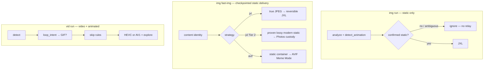

# Modern Format Boost


-E57324?style=for-the-badge&logo=rust&logoColor=white>)


**Evidence-driven media optimization — preserve source semantics, verify delivery, fail closed.**

[English](README.md) · [简体中文](docs/README_ZH.md)

## What is Modern Format Boost?

**Modern Format Boost** is a Rust media optimizer with separate owners for
static and time-based media:

- **`img run`** is the general static-image pipeline. Exact local detection is
  the default; PostgreSQL is consulted only when an optional quality heuristic
  is explicitly enabled. The current CLI delivers **JXL only** (`--codec
hevc`); `--codec av1` is rejected with an instruction to use FastImg Meme
  Mode.
- **`img fast-img`** is the bounded, checkpointed production path. Its default
  `jxl` strategy converts true JPEG bitstreams to reversible JXL and runs a
  second, destructive-gated Photos-delivery tier for positively proven lossy
  static WebP/JP2/JXL/AVIF/HEIC originals. `--strategy avif` selects AVIF Meme
  Mode for static image containers.
- **`vid run`** owns video and animated raster delivery to HEVC/AV1 (HEVC by
  default). `img` never silently relays work to `vid`.
- **Format identity is content-based**: magic bytes, container structure and
  animation evidence take precedence over the filename extension. An
  extension mismatch is audited; it is not trusted as the media type.

Typical routes:

- 📸 **`img run`**: JPEG/PNG/lossless modern → JXL; already-lossy modern stills
  and existing JXL usually skip; animated or inconclusive animatable files are
  ignored.
- ⚡ **`img fast-img --strategy jxl`**: true JPEG → reversible JXL; eligible
  modern lossy static originals → verified Apple Photos custody (Tier 2).
- 🧩 **`img fast-img --strategy avif`**: confirmed-static image containers →
  bounded AVIF size/quality search with final integrity verification.
- 🎬 **`vid run`**: H.264, animated WebP/GIF, etc. → HEVC/AV1 quality search; container from `--codec` and `--apple-compat`

Routing source of truth: [`delivery_codec_strategy.rs`](crates/foundation/src/convert/delivery_codec_strategy.rs).

### What it guarantees—and what it does not

- A conversion candidate is delivered only after its route-specific decode,
  quality, metadata and integrity gates pass. Size-constrained routes compare
  encoded media payloads and require the candidate to fit the active policy;
  if no candidate fits, the source is retained and the result is skip/failure.
- JPEG→JXL delivery requires a byte-identical `djxl --reconstruct_jpeg` proof
  after metadata commit. Reconstruction-owned JBRD/Exif/XMP/JUMBF bytes remain frozen;
  external XMP is appended as an idempotent overlay and the exact reconstruction
  proof is repeated. `restore-jpeg` keeps the recovered JPEG bytes unchanged and
  delivers adjacent XMP as a separately hashed `.xmp` sidecar. If container XMP
  and adjacent XMP differ, the JPEG is still classified as exactly reversible;
  the source JXL is retained with an explicit metadata-review proof so neither
  metadata layer is silently discarded.
- Overlay commits use a same-directory temporary file, source identity/hash
  recheck, atomic rename and file/parent flush. A versioned audit chain records
  JBRD, overlay, final-container and reconstruction hashes without storing
  media content; see the [archive contract](docs/hardening/JXL_XMP_ARCHIVE_CONTRACT.md).
- This is not a magic size reducer. Container metadata can make the complete
  file larger even when the media payload passes, and a high-quality candidate
  may provide no storage saving at all.
- Exploration spends time to find the highest-quality candidate that satisfies
  the active size/quality policy. Runtime rises with the number, complexity and
  diversity of inputs; `--ultimate` deliberately trades more time for a finer
  search.

### Who should use it

The most exercised path is macOS with Apple-oriented media libraries and
explicit Photos delivery. Users on Linux and Windows can use adjacent-output
and local conversion paths, but Apple Photos custody, TCC and iCloud checks are
macOS-only and non-Apple production coverage is currently less mature. Keep an
independent backup for irreplaceable archives on every platform.

### Why this project exists

Most one-shot converters apply one quality, effort and speed policy to every
file. Modern Format Boost instead treats each media item as an independent
search and delivery decision: it spends more time finding a candidate that
satisfies the active size/quality policy, then verifies metadata and integrity
before cleanup. The extra runtime is intentional; a small or fast result is not
accepted as a substitute for an auditable one.

The wider workspace—database, training and quality gates—exists to make those
decisions inspectable and to catch silent fallback. Optional systems remain
optional: ordinary `img run`, FastImg and JPEG restoration use exact local
analysis by default, while PostgreSQL and learned quality heuristics are used
only by commands or options that explicitly request them. The project welcomes
platform-specific production evidence, especially for Linux and Windows paths
that have less real-world coverage today.

Think of it as a conservative optimizer that prefers honest skip/ignore
outcomes over silent quality damage:

- 🍎 **Apple-aware output**: `img run` enables Apple compatibility by default,
  including Apple-safe JXL box handling; Photos delivery is a separate,
  explicitly gated FastImg policy.
- 🔒 **Metadata guardian**: Preserves EXIF, XMP, ICC profiles, timestamps,
  macOS xattrs and Finder tags when the target supports them. Metadata that
  would re-apply a normalized transform (notably EXIF Orientation) is verified
  and removed deliberately rather than copied blindly.
- ⚡ **Perceived Speed Optimization**: "Deep-First" sorting strategy—prioritizes
  deeper directory levels first, then sorts by file size and format, to ensure
  efficient batching and maximum throughput.
- 🎞️ **HDR10+ Dynamic Metadata**: Full retention of SMPTE 2094-40 metadata via
  extraction sidecars and x265 SEI injection.
- 🌅 **HDR Gainmap Preservation**: HEIC gainmaps may synthesize high-fidelity
  HDR JXL while preserving non-embeddable auxiliary assets such as depth maps.
  UltraHDR JPEG instead follows the exact JPEG-archive path by default, keeping
  its complete MPF/gainmap container byte-reconstructible.
- **🔍 Vendor Metadata Awareness**: Intelligent scanning for Samsung/Google
  specific XMP namespaces in HEIC files to ensure maximum context preservation.

## ⚠️ Disclaimer & Important Notes

1. **Data Safety First**: To avoid any potential data loss, it is highly
   recommended to output processed files to a separate directory (e.g., using
   `-o /path/to/output`) rather than using in-place conversion (`--in-place`),
   especially for irreplaceable media.
2. **Beta Software**: While this program has been extensively tested,
   debugged, and optimized to prevent quality or data loss (as seen in the
   changelog), it is not guaranteed to be 100% bug-free. Please report any
   issues you encounter on GitHub.
3. **Computation Insight**: While optimized for efficiency (especially on Apple
   Silicon M-series), processing massive batches in `--ultimate` mode can still
   be time-consuming. It will occupy system resources for an extended period;
   please plan your task accordingly.
4. **Strategy Names Are Command-Specific**: `img run` is JXL-only today;
   FastImg AVIF is selected with `--strategy avif`; `vid run` uses
   `--codec hevc|av1`. Do not infer an image format from the video codec names.

## 🔒 Privacy & Data Integrity

**Modern Format Boost** is built on a "Local-First" architecture, ensuring your
creative assets remain entirely within your control.

- **Local Media Processing**: Conversion and verification operate on local
  media without telemetry or cloud upload. Package installation, dependency
  download and CI tooling may still use the network.
- **Rust-Hardened Runtime**: Rust removes broad classes of memory-unsafe code,
  while explicit bounds, parser limits and delivery gates address the remaining
  logic and integration risks.
- **Secure Integration**: All external tools (FFmpeg, cjxl) are invoked via
  safe, escaped primitives—never through raw shell execution—preventing
  arbitrary command injection.
- **Path Isolation**: Advanced normalization prevents directory traversal and
  protects unrelated system files.
- **System Path Blocklist**: Built-in shields for sensitive system directories
  to prevent accidental OS file modifications.
- **Dynamic Resource Balancing**: Automatically adjusts processing threads based
  on memory/CPU load to prevent system crashes during extreme tasks.
- **Metadata Custody**: EXIF, XMP, ICC and filesystem timestamps are preserved
  or explicitly normalized and verified according to the destination format;
  the project does not claim every metadata container is copied bit-for-bit.
- **Secure Processing & Session Isolation**:
  - **Centralized Progress State**: Tracking under `~/.mfb_progress/` keeps
    durable markers out of the media tree; target working copies and explicitly
    requested outputs remain visible next to their source when that policy is used.
  - **Conflict-Free Temp Files**: Every intermediate analysis file (YUV
    streams, analysis segments) is uniquely identified with a randomized UUID.
    This prevents multi-instance collisions and ensures "Surgical Precision"
    during cleanup.
  - **Bounded Cleanup**: Disposable intermediates are cleaned while durable
    markers remain available for an explicit, identity-checked retry. A marker
    is not treated as permission to resume or delete a source silently.
  - **Intelligent Checkpoint Reset**: Automatically detects when a user
    manually deletes the output directory to "start over", triggering a full
    state reset even in resume mode.

## 🛠️ Deep Technical: How It Works — The Pipeline

### Image Pipeline Logic

Every file goes through a multi-stage decision pipeline:

- **Stage 1 — Detect & Classify**: Resolves the true container, animation state,
  compression semantics, JPEG reconstruction data, gainmaps and precision
  before choosing a destructive or lossy route. Unknown evidence stays unknown.
- **Stage 2 — Route & Encode**: True JPEG uses reversible JPEG reconstruction
  when the JBRD path is available; lossless sources use lossless JXL (`d=0`);
  quality-matched lossy routes are kept separate from lossless claims. Adjacent
  XMP is appended after the immutable reconstruction layer and the final JXL is
  re-proved before delivery; generic metadata rewrites never touch JBRD output.
- **Stage 3 — Detour Pathway**: Formats like TIFF/WebP/BMP/HEIC are
  pre-processed into temporary 16-bit PNGs or **32-bit OpenEXR** to ensure
  `cjxl` compatibility without silently reducing the detected precision. A
  recoverable native-decoder failure can use FFmpeg/ImageMagick adapters only
  on an explicitly permitted path; every resulting candidate still runs the
  normal structure, pixel/orientation, metadata and size gates.
- **Stage 4 — HDR Gainmap Handling**: HEIC gainmap assets may synthesize true
  HDR JXL and preserve non-embeddable depth/gainmap assets as sidecars.
  UltraHDR JPEG is archived through JBRD instead: the original JPEG, including
  its MPF gainmap and private metadata, must reconstruct byte-for-byte. Explicit
  UltraHDR pixel synthesis is non-archival and is never selected automatically
  by a destructive or verified-delivery path.
- **Stage 5 — Static-only on `img`**: `img run` **ignores** animated assets
  (`IMG_ANIMATED_HANDOFF`). Use **`vid run`** for GIF/WebP/APNG and all video.
- **Stage 6 — Verify & Commit**: Output structure, decoded pixels/orientation,
  size policy and metadata are checked before delivery. Source removal is a
  later commit step, not evidence that encoding succeeded.

### Video Pipeline: Three-Phase Saturation Search

1. **Phase 1: GPU Coarse Search**: Binary search on hardware encoders
   (VideoToolbox/NVENC) to find the "quality knee".
2. **Phase 2: CPU Fine-Tune**: Maps GPU CRF to `x265` scale. Uses **Sprint &
   Backtrack** (double step on success, reset to 0.1 on overshoot).
3. **Phase 3: Ultimate 3D Quality Gate**: Requires simultaneous pass of
   VMAF-Y ≥ 86.0 (sanity floor, dynamic baseline-relative), CAMBI ≤ 6.0
   (banding), and PSNR-UV ≥ 30.0 dB (chroma sanity floor).
   - **Fusion Scoring**: Combines MS-SSIM + SSIM_All (0.6/0.4 weight) for robust
     structural analysis.
   - **Chroma Guard**: Automatically detects small resolutions that would crash
     libvmaf MS-SSIM and falls back to Y-only scoring to ensure processing
     reliability.
   - _Note: In `--ultimate` mode, **50 consecutive samples** with no quality
     gain form the configured saturation stop; this is a convergence policy,
     not a proof of a mathematical global optimum._

### Metadata & HDR Preservation

- **HDR**: Preserves bt2020 primaries, PQ/HLG TRC, and Mastering Display
  metadata.
- **Dolby Vision**: Extracts RPU via `dovi_tool` and injects into x265
  (Profile 7 → 8.1 conversion).
- **macOS xattrs**: Preserves Finder Tags, Date Added, and creation timestamps
  via `copyfile` and `setattrlist`.

### 🖥️ Runtime


Runtime

### The Two Binaries

| Binary    | Owner                   | Primary output     | Format selection                                   |
| --------- | ----------------------- | ------------------ | -------------------------------------------------- |
| **`img`** | Static stills only      | JXL / AVIF / skip  | `img run`→JXL; `img fast-img --strategy jxl\|avif` |
| **`vid`** | Video + animated raster | MP4/MOV/GIF / skip | `vid run --codec hevc\|av1` (default `hevc`)       |

Plus a **double-click native macOS app** (`Modern Format Boost.app`) for
drag-and-drop batch processing. It is implemented directly with AppKit: there
is no embedded browser, WKWebView, Vue/Node runtime or network-loaded UI. The
app invokes the same Rust launcher and preserves the existing bundle identity,
code-signing and Photos Automation (TCC) preflight. Native English, Simplified
Chinese and Japanese resources can be switched at runtime; appearance follows
the system by default with explicit light/dark choices. Linux and Windows
retain the CLI for now; future GUI ports should use their own native platform
adapter.

## Delivery strategies

Rust SSOT: [`delivery_codec_strategy.rs`](crates/foundation/src/convert/delivery_codec_strategy.rs).

The command surfaces intentionally do not pretend that still-image and video
codec names are interchangeable:

| Command        | Supported selector       | Result                                        |
| -------------- | ------------------------ | --------------------------------------------- |
| `img run`      | `--codec hevc` (default) | JXL static-image pipeline                     |
| `img run`      | `--codec av1`            | Rejected; use FastImg Meme Mode               |
| `img fast-img` | `--strategy jxl\|avif`   | Reversible-JPEG/Tier-2 path or AVIF Meme Mode |
| `vid run`      | `--codec hevc\|av1`      | HEVC or AV1 video/animation delivery          |

**`img`** only **encodes static stills**. It **never forwards** to **`vid`**; animated or ambiguous animatable files are **ignored** (`img_animated_handoff` = ignore-only audit token). **True single-frame** animatable files (verified GIF/WebP/APNG container, no cover-stream ambiguity) may stay on **`img`**. Not extension-only.

### Two layers

| Layer                                  | `img`                  | `vid`        |
| -------------------------------------- | ---------------------- | ------------ |
| **Static still delivery** (JXL / AVIF) | ✅ subcommand/strategy | —            |
| **Video delivery codec** (HEVC / AV1)  | —                      | ✅ `--codec` |



### `img run`

| Input                                          | Action                                                       |
| ---------------------------------------------- | ------------------------------------------------------------ |
| Static JPEG (including UltraHDR)               | Byte-reconstructible JXL archive followed by delivery checks |
| PNG / lossless modern / supported HEIC gainmap | Lossless JXL conversion or HDR synthesis and delivery checks |
| Lossy modern still / existing JXL still        | Usually skip to avoid generational loss or redundant work    |
| Animated or unverified animatable container    | Ignore on `img`; run `vid` separately if wanted              |

`img run` enables content exploration, quality matching, compression, metadata
preservation, timestamp preservation, recursion and Apple compatibility by
default. PostgreSQL is used only when the optional static-quality heuristic is
explicitly enabled; the default exact-detection path and FastImg do not require
or probe the database.

### `img fast-img`

| Strategy           | Primary path                                                                            | Destructive gate                                                                                                                        |
| ------------------ | --------------------------------------------------------------------------------------- | --------------------------------------------------------------------------------------------------------------------------------------- |
| `jxl` (default)    | Content-confirmed JPEG → reversible JPEG-reconstruction JXL in an adjacent working tree | Decode/integrity, orientation/metadata, BLAKE3 and final-delivery proof before source cleanup                                           |
| `jxl` Tier 2       | Confirmed-static, confirmed-lossy WebP/JP2/JXL/AVIF/HEIC original → Apple Photos        | Live library reconciliation plus asset UUID/content-hash custody before deleting that exact source                                      |
| `avif` (Meme Mode) | Confirmed-static image container → bounded AVIF quality/size search                     | Final candidate is re-encoded and verified in the delivery encoder domain before cleanup; `--shortest-path` adds verified Photos import |

Tier 2 is deliberately positive-evidence-only. Lossless media, JXL carrying
JPEG reconstruction data, animated media, generic HEIF, unreadable media and
unknown compression semantics are retained. JXL outputs themselves stay local:
without `--shortest-path` they are delivered only to the adjacent working tree;
with `--strategy jxl --shortest-path`, the same checkpointed Photos import and
live-library verification gates run before source cleanup.

`img run` and FastImg share the same low-level integrity, metadata, path-safety
and final-commit primitives, but they are not the same processing strategy:

| Concern             | `img run`                                                                                             | `img fast-img`                                                                               |
| ------------------- | ----------------------------------------------------------------------------------------------------- | -------------------------------------------------------------------------------------------- |
| Product goal        | Broad static-image optimization and safe skip/copy routing                                            | Bounded, resumable production delivery                                                       |
| Analysis            | Exact local detection by default; optional cache/database heuristics plus HDR/precision/color detours | Content identity plus the evidence required by the selected JXL/AVIF path                    |
| JPEG → JXL          | Requires exact reconstruction for replacement; otherwise retains the source                           | Requires exact JPEG reconstruction for the JXL primary tier; otherwise retains the source    |
| Modern lossy stills | Usually retained to avoid generational loss                                                           | JXL Tier 2 imports a positively proven lossy original without re-encoding it                 |
| AVIF                | Not selected through the normal `img run` codec surface                                               | Meme Mode performs its bounded size/quality search in the final AVIF encoder domain          |
| Photos              | Apple compatibility is an output policy, not an import claim                                          | `--shortest-path` uses checkpointed import plus live Photos UUID/content proof               |
| Cleanup             | Only when explicitly requested and after final verification                                           | Mandatory for each proven delivery; incomplete/ambiguous sources remain with resumable state |

### Abnormal or decoder-hostile stills

An encoder error is not treated as proof that the source is unusable. A true
JPEG—including a grayscale JPEG—is first submitted directly to libjxl's JPEG
bitstream-reconstruction path; grayscale alone does not trigger a detour. If a
damaged structure or incompatible profile prevents reconstruction, the guarded
JPEG ladder may retry a metadata-safe structural rebuild. FastImg still
requires exact JPEG reconstruction and retains the source when that proof
cannot be produced.

Standard `img run` can, when the expert recovery policy is explicitly enabled,
normalize a decoder-hostile still through a lossless FFmpeg/ImageMagick raster
adapter and then repeat structure, decoded-pixel/orientation, metadata and size
verification. That result is recorded as pixel re-encoding, never mislabeled as
reversible JPEG reconstruction. If every applicable decoder/fallback is
unavailable, disabled, ambiguous or fails a gate, the candidate is discarded
and the source plus sidecars are retained.

### Actual static-image scope

“Static image support” means formats the project can identify and route with
positive evidence—not every historical image or private camera format:

| Scope                                       | Formats / behavior                                                                                                                                                              |
| ------------------------------------------- | ------------------------------------------------------------------------------------------------------------------------------------------------------------------------------- |
| Content-signature identity                  | JPEG/JFIF, PNG/APNG, WebP, GIF, TIFF/BigTIFF, BMP, HEIC/HEIF/HIF, AVIF, JXL, JP2/J2K, ICO/CUR, QOI, EXR, FLIF, PSD, PNM and DDS; recognition is not a conversion promise        |
| Normal `img` discovery                      | PNG, JPEG/JPE/JFIF, WebP, GIF, TIFF, HEIC/HEIF/HIF, AVIF, BMP, ICO/CUR, SVG, JP2/J2K, JXL, WBMP and enumerated camera-RAW extensions                                            |
| Proven conversion core                      | Confirmed-static JPEG, PNG, WebP, TIFF, BMP and supported HEIC/HEIF inputs; lossless modern stills and HDR gainmaps take evidence-specific routes                               |
| FastImg JXL                                 | True JPEG bitstreams for reversible JXL; Tier 2 only for positively proven lossy static WebP, JP2, JXL, AVIF and codec-constrained HEIC                                         |
| FastImg AVIF                                | Confirmed-static inputs accepted by an authoritative decoder; expert-only external adapters remain opt-in and still require final evidence                                      |
| Decoder-dependent / best effort             | SVG and camera RAW extensions may enter discovery, but success depends on an installed authoritative decoder; QOI/FLIF and other recognized containers are not blanket-admitted |
| Explicitly outside normal raster conversion | PSD/PSB, AI/EPS/PDF, TGA, DDS, HDR/EXR and PNM-family design/scientific assets; unknown/private formats are copied, skipped or ignored rather than guessed                      |

Animated or multi-page content is not silently flattened by `img`; verified
animation belongs to `vid`, while inconclusive input is retained.

### `vid run` + `--codec hevc` (default)

| Stage               | What happens                                                                                                                                                                                                                                                                                     |
| ------------------- | ------------------------------------------------------------------------------------------------------------------------------------------------------------------------------------------------------------------------------------------------------------------------------------------------ |
| **Loop intent**     | GIF fast-path + `assess_loop_intent`; with `--apple-compat`, short modern animations may be forced to **stay GIF**; `--force` bypasses GIF routing.                                                                                                                                              |
| **Skip rules**      | Normal mode: already-HEVC often skipped; VP9/AV1/VVC skipped. Apple mode: VP9/AV1/VVC may be **converted to HEVC** instead of skipped.                                                                                                                                                           |
| **Lossless source** | `delivery_target(..., lossless=true)` → **HEVC lossless MKV** (archival).                                                                                                                                                                                                                        |
| **Lossy video**     | Target MP4 `hev1` or MOV `hvc1`; CRF from quality tier or explore; **`explore_hevc_with_gpu`** → x265 fine-tune; `--ultimate` → dual preset + 3D gate + slower final encode; HDR explore passes **`hdr_x265_params`**; Apple fallback may keep sub-target HEVC if size wins but SSIM gate fails. |

### `vid run` + `--codec av1`

| Stage               | What happens                                                                                                                                                       |
| ------------------- | ------------------------------------------------------------------------------------------------------------------------------------------------------------------ |
| **Loop / skip**     | Same loop-intent and skip policy until delivery.                                                                                                                   |
| **Lossless source** | Still routed to **HEVC lossless MKV** today (AV1 archival not implemented).                                                                                        |
| **Lossy video**     | **MP4 `av01` only**; **`explore_av1_with_gpu`** + SVT; **no** `--apple-compat`; already-AV1 sources may skip in normal mode; no x265 HDR merge on explore request. |

### Shared flags (`vid` video / animated paths)

| Flag              | HEVC                                                   | AV1                                       |
| ----------------- | ------------------------------------------------------ | ----------------------------------------- |
| `--explore`       | GPU HEVC coarse + x265 fine                            | GPU AV1 + libsvtav1                       |
| `--match-quality` | Quality-matched CRF search                             | Same                                      |
| `--ultimate`      | 3D gate + **faster preset search → slower x265 final** | SVT explore preset (no dual-preset final) |
| `--apple-compat`  | MOV `hvc1`, GIF policy, VP9/AV1→HEVC                   | **CLI error** — use `hevc`                |
| `--use-gpu`       | VideoToolbox / NVENC                                   | AV1 GPU coarse where available            |

### Policy comparison

| Policy                    | HEVC                                       | AV1                     |
| ------------------------- | ------------------------------------------ | ----------------------- |
| Default CLI               | yes                                        | `--codec av1`           |
| Container                 | MP4 (`hev1`) or MOV (`hvc1` + Apple)       | MP4 (`av01`) only       |
| CPU encoder               | `libx265`                                  | `libsvtav1`             |
| Ultimate explore          | Dual preset (faster search → slower final) | Single SVT preset path  |
| HDR (DV/HDR10+)           | x265 merge on explore                      | Not on AV1 explore path |
| Warm-start CRF            | Global HEVC hit cache                      | Global AV1 hit cache    |
| Lossless archival (`vid`) | HEVC MKV                                   | Still HEVC MKV today    |

## 📉 Compression expectations

Compression ratios depend on source entropy, prior encoding, metadata and the
installed encoder version. The project therefore does not publish synthetic
fixed-percentage claims as guarantees. A candidate that misses the configured
size/quality/delivery gates is skipped or retained rather than reported as a
successful optimization.

## 📊 Processing Matrix

### Image Format Decision Matrix

| Input Format                                     | Static? | Action in `img run`           | Output        | Notes                                                 |
| :----------------------------------------------- | :-----: | :---------------------------- | :------------ | :---------------------------------------------------- |
| JPEG                                             |   ✅    | **Reversible reconstruction** | `.jxl`        | Original JPEG recovery is verified when JBRD succeeds |
| PNG / TIFF / BMP / other lossless stills         |   ✅    | **Lossless convert**          | `.jxl`        | May use detour pathway first                          |
| WebP / AVIF / HEIC / HEIF / JP2 (lossless still) |   ✅    | **Convert**                   | `.jxl`        | Lossless modern stills are allowed                    |
| HEIC / HEIF with Gainmap                         |   ✅    | **HDR synthesis**             | `.jxl`        | Gainmap path synthesizes linear HDR                   |
| Legacy lossy stills after static validation      |   ✅    | **Near-lossless convert**     | `.jxl`        | Current `img run` batch path stays JXL-focused        |
| Lossy WebP / AVIF / HEIC / HEIF / JP2 still      |   ✅    | **Skip**                      | keep original | Avoid generational loss                               |
| JXL still                                        |   ✅    | **Skip**                      | keep original | Already optimal                                       |
| Animated GIF / WebP / APNG / HEIC / HEIF / JXL   |   ❌    | **Ignore on img**             | —             | Use **`vid run`** → `.mp4` / `.mov`                   |

### `img` entrypoints

| Entry                              | Static output                                                                  | Animated          | AVIF                                         |
| ---------------------------------- | ------------------------------------------------------------------------------ | ----------------- | -------------------------------------------- |
| **`img run`**                      | JXL (`--codec hevc`)                                                           | Ignored           | Not exposed; `--codec av1` is rejected       |
| **`img fast-img --strategy jxl`**  | Reversible JXL for true JPEG; Tier-2 custody for proven lossy modern originals | Retained/ignored  | Existing lossy AVIF may be a Tier-2 original |
| **`img fast-img --strategy avif`** | AVIF Meme Mode                                                                 | Rejected/retained | Primary output                               |
| **`smart_convert()`**              | Library API: JXL or retain per `determine_strategy`                            | Domain ignore     | Not available; use FastImg Meme Mode         |

### Animated Media Decision Matrix (`vid` only)

| Input Format                                        | Owner                 | Action                | Output          | Notes                              |
| :-------------------------------------------------- | :-------------------- | :-------------------- | :-------------- | :--------------------------------- |
| GIF                                                 | `vid`                 | **Loop-intent route** | `.gif` or video | `--apple-compat` policy            |
| Animated WebP / AVIF / APNG / HEIC / HEIF / JXL     | `vid`                 | **HEVC/AV1 delivery** | `.mp4` / `.mov` | `animated_image` + `--codec`       |
| Short silent modern animation with `--apple-compat` | `vid` + `loop_intent` | **Force GIF**         | `.gif`          | Duration `<= 6s`                   |
| Long modern animation with `--apple-compat`         | `vid` + `loop_intent` | **Do not force GIF**  | video target    | Duration `>= 15s` stays video-like |
| Uncertain modern animation with `--apple-compat`    | `vid` + `loop_intent` | **Force GIF**         | `.gif`          | Compatibility fallback             |

### Video Codec Decision Matrix

| Input Codec                    | Normal Mode           | `--apple-compat` Mode | Notes                                                |
| :----------------------------- | :-------------------- | :-------------------- | :--------------------------------------------------- |
| H.264 (AVC)                    | **Convert**           | **Convert**           | Not pre-skipped in either mode                       |
| VP9                            | **Skip**              | **Convert to HEVC**   | Apple-incompatible source                            |
| AV1                            | **Skip**              | **Convert to HEVC**   | Apple-incompatible source                            |
| VVC / AV2                      | **Skip**              | **Convert to HEVC**   | Apple-incompatible source                            |
| HEVC (H.265)                   | **Skip**              | **Skip**              | Already Apple-native target                          |
| ProRes / DNxHD / legacy codecs | **Convert as needed** | **Convert as needed** | Final keep/skip still depends on optimization result |

Quality and size gates still apply after routing. In `--ultimate` and other
quality-matching flows, a route that is eligible for conversion may still end as
skip if the produced file fails quality/size requirements and no allowed
best-effort fallback applies.

### HDR Format Strategy

| HDR Type          | Detection                                | Preservation Strategy                                                                                                                                      |
| :---------------- | :--------------------------------------- | :--------------------------------------------------------------------------------------------------------------------------------------------------------- |
| **HDR10**         | mastering_display + max_cll in side_data | Static metadata fully preserved via FFmpeg args                                                                                                            |
| **HEIC Gainmap**  | HEIC auxiliary image (Apple/Samsung/ISO) | Synthesized to 32-bit linear HDR -> JXL (True HDR)                                                                                                         |
| **UltraHDR JPEG** | JPEG APP1/APP2 + XMP (hdrgm:)            | Exact JPEG→JXL archive by default; the full MPF/gainmap JPEG reconstructs byte-for-byte. Explicit pixel synthesis is non-archival and non-destructive only |
| **HLG**           | color_trc = arib-std-b67                 | Color primaries + TRC preserved                                                                                                                            |
| **Dolby Vision**  | DOVI side_data in streams/frames         | RPU extraction via `dovi_tool` → x265 injection; Profile 7 → 8.1 conversion                                                                                |
| **HDR10+**        | ST2094-40 dynamic metadata               | Supported via `hdr10plus_tool` sidecar extraction and x265 injection (Profile A/B metadata retention)                                                      |
| **SDR**           | No HDR markers                           | Standard processing (yuv420p)                                                                                                                              |

## ⬇️ Installation

### Pre-compiled Binaries

For users who do not wish to install the Rust toolchain, you can download
pre-compiled binaries from the
**[Releases](https://github.com/nowaytouse/modern-format-boost/releases)** page.

```bash
# macOS/Linux One-liner (example for macOS ARM64)
curl -LO https://github.com/nowaytouse/modern-format-boost/releases/latest/download/modern-format-boost-aarch64-apple-darwin.tar.gz
tar -xzf modern-format-boost-aarch64-apple-darwin.tar.gz
```

### Prerequisites

| Tool                 |  Required?  | Purpose                                              | Install Command                                                                             |
| :------------------- | :---------: | :--------------------------------------------------- | :------------------------------------------------------------------------------------------ |
| **Rust** (nightly)   |     ✅      | Build & Install                                      | `curl --proto '=https' --tlsv1.2 -sSf https://sh.rustup.rs \| sh && rustup default nightly` |
| **FFmpeg** (5.0+)    |     ✅      | Video processing & Metrics                           | `brew install ffmpeg` / `apt install ffmpeg`                                                |
| **libjxl**           |     ✅      | JXL encoding core                                    | `brew install jpeg-xl`                                                                      |
| **ExifTool**         |     ✅      | Metadata preservation                                | `brew install exiftool`                                                                     |
| **ImageMagick**      |     ✅      | Image detour pathway                                 | `brew install imagemagick`                                                                  |
| **libwebp**          |     ✅      | WebP native decoding                                 | `brew install webp`                                                                         |
| **libheif**          |     ✅      | HEIC/HEIF decode                                     | `brew install libheif`                                                                      |
| **PostgreSQL** (12+) | Conditional | Vid, training, cache and optional quality heuristics | `brew install postgresql pgvector` / `apt install postgresql`                               |
| **dovi_tool**        |  Optional   | Dolby Vision RPU extraction                          | `cargo install dovi_tool`                                                                   |
| **hdr10plus_tool**   |  Optional   | HDR10+ metadata extraction                           | `cargo install hdr10plus_tool`                                                              |

#### macOS (Homebrew)

```bash
brew install ffmpeg jpeg-xl exiftool imagemagick webp libheif postgresql pgvector
# Optional (for Dolby Vision / HDR10+ sources):
# cargo install dovi_tool hdr10plus_tool
```

> [!TIP]
> For power users who want all advanced features (AI filters, FDK-AAC, etc.),
> see
> our [Advanced FFmpeg Setup Guide](docs/FFMPEG_SETUP.md) for instructions on
> installing a full-featured version without breaking system dependencies.

#### Linux (Ubuntu/Debian)

```bash
sudo apt update && sudo apt install ffmpeg libimage-exiftool-perl imagemagick \
  webp libheif-dev postgresql postgresql-contrib postgresql-server-dev-all
# pgvector must be compiled and installed on Linux:
git clone --branch v0.5.1 https://github.com/pgvector/pgvector.git
cd pgvector
make && sudo make install
# JPEG XL (libjxl) may need PPA or source build on older distros
```

#### Windows

Recommended: Use **winget** for one-liner installation:

```powershell
winget install ffmpeg.ffmpeg ImageMagick.ImageMagick OliverBetz.ExifTool \
  libheif.libheif Google.WebP PostgreSQL.PostgreSQL
# Note: Copy pgvector binaries to your PostgreSQL folder. See https://github.com/pgvector/pgvector
# Optional (for Dolby Vision / HDR10+ sources):
# cargo install dovi_tool hdr10plus_tool
```

### 🗄️ Database Setup

Modern Format Boost uses PostgreSQL (with the `pgvector` extension) for Vid,
training, cache-management commands and explicitly enabled quality heuristics.
Normal `img run`, FastImg and JPEG restoration use exact local detection by
default and do not connect to PostgreSQL. When a database-backed feature is
selected, an unreachable database remains a fail-closed startup error.

#### 1. Start PostgreSQL Service

- **macOS**: `brew services start postgresql`
- **Linux**: `sudo systemctl start postgresql`

#### 2. Create the Database

The default database name is `modern_format_boost`. Create it before running the tools:

```bash
createdb modern_format_boost
```

Or via SQL:

```sql
CREATE DATABASE modern_format_boost;
```

_Note: The application automatically initializes the required schemas, tables, and enables the `vector` extension upon the first successful connection. No manual SQL migrations are needed for initialization._

## ⚙️ Environment Variables & Tuning

Customize execution parameters by setting the following environment variables:

| Variable             | Default Value                                | Description                                                                |
| :------------------- | :------------------------------------------- | :------------------------------------------------------------------------- |
| `MFB_PG_CONNSTR`     | `postgresql://localhost/modern_format_boost` | Connection string for the PostgreSQL server.                               |
| `MFB_HOME_ROOT`      | `~/.modern_format_boost`                     | Config root path and persistent training data folder.                      |
| `MFB_LOG_DIR`        | `~/.modern_format_boost/logs`                | Folder for session and tool logs (cannot be under the git workspace).      |
| `MFB_PERF_TIER`      | (Auto-detected)                              | Threading/fan-out schedule: `relaxed`, `balanced`, or `tight`.             |
| `MFB_LOW_MEMORY`     | `0` (false)                                  | Set to `1` to force the governor to operate in `tight` resource tier.      |
| `MFB_MULTI_INSTANCE` | `0` (false)                                  | Set to `1` to downscale resource ceilings under multi-instance contention. |

### ⚡ Performance Governor Scheduler (SSOT)

MFB employs a live memory governor to dynamically adjust parallel batch sizes and thread allocations based on memory pressure. It operates in three tiers:

- **`relaxed`**: Max headroom mode with high parallelism caps. Enabled when system memory pressure is low.
- **`balanced`**: Default mode balancing throughput and resource footprints.
- **`tight`**: Strict mode with capped concurrency and higher reserved CPU cores. Triggered automatically under high memory pressure or when available system memory falls below **2304 MB** or available RAM ratio is below **24%** (`PREEMPTIVE_TIGHT` guards).

### Build from Source

```bash
git clone https://github.com/nowaytouse/modern-format-boost.git
cd modern-format-boost
cargo build --release

```

## 🚀 Usage

### Quick Start

```bash
# Static stills → JXL (animated files in tree are ignored)
img run /path/to/media

# FastImg: true JPEG → reversible JXL; eligible modern lossy static originals
# are handled by the verified Tier-2 Photos-delivery gate.
img fast-img --strategy jxl /path/to/media

# FastImg Meme Mode: confirmed-static containers → AVIF.
img fast-img --strategy avif /path/to/media

# Add verified Apple Photos delivery to AVIF Meme Mode (macOS).
img fast-img --strategy avif --shortest-path /path/to/media

# Restore exact JPEGs and isolate non-reversible historical JXL automatically.
img restore-jpeg /path/to/archive

# On macOS, selecting a Photos library automatically audits its live assets.
img restore-jpeg /path/to/Library.photoslibrary

# List live user folders/albums, then restrict the same audit by native UUID.
img photos-albums /path/to/Library.photoslibrary
img restore-jpeg /path/to/Library.photoslibrary --photos-album-id ALBUM_UUID
img restore-jpeg /path/to/Library.photoslibrary --photos-folder-id FOLDER_UUID

# Re-check affected JXLs and collect only their originals + XMP from a backup.
collect_optimized /path/to/audited /path/to/recovered --backup /path/to/backup --yes

# Compare two Photos libraries without modifying either library.
# For folder/file deduplication, use a dedicated external deduplication tool.
collect_optimized /path/to/current /path/to/report --backup /path/to/backup --compare

# Video + animated raster (HEVC default)
vid run /path/to/media

# AV1 delivery
vid run --codec av1 /path/to/media

# Preview strategy for one file
vid strategy --codec hevc /path/to/video.mp4
```

### ⚡ FastImg state and resumption

FastImg records durable stage, relative-path and BLAKE3 evidence in an adjacent
working copy. State handling is explicit:

- a matching interrupted task requires `--retry` (or interactive consent);
- `--no-resume` creates an isolated adjacent task instead of reusing state;
- changed paths, counts or source hashes invalidate reuse;
- an interrupted Photos import is reconciled against the live library before
  progress resumes;
- an encode/import error may use bounded retry internally, but that is separate
  from resuming a process that exited or lost power.

### Detailed Options

- `img run --ultimate`: enables the ultimate JXL exploration/verification tier
  and selects JXL effort 11. It costs substantially more CPU time.
- `img run --archive`: expresses maximum-compression intent and normalizes JXL
  encoding to the same effort-11 tier. `img fast-img --archive` applies effort
  11 to reversible JPEG→JXL encoding.
- `img run --apple-compat`: enabled by default; selects Apple-safe JXL box
  handling and Apple-aware metadata policy. `--no-apple-compat` disables it.
- `img fast-img --shortest-path`: for both JXL and AVIF strategies, runs local
  verification, verified Photos import, UUID/hash custody Gates 2/3, and only
  then permits source/output cleanup. No second import flag is required.
- `img fast-img --retry`: resumes only after the stored source identity and
  live delivery state match. `--no-resume` starts an isolated task.
- `img restore-jpeg INPUT` has no behavior mode to choose. A normal file or
  folder restores every byte-exact JPEG and its validated XMP delivery; JXL
  that needs backup recovery or manual review stays untouched and receives a
  marker under mirrored `Reconstruction Blocked` / `Needs Review` trees. A
  Photos library (or one concrete asset path inside it) instead performs a live
  UUID audit: exact-reversible assets remain unmarked, while affected existing
  assets are referenced in `MFB JXL Audit` albums preserving their original
  folder/album hierarchy. MFB never rewrites media bytes or edits Photos database
  files directly; Photos records only album membership. An external BLAKE3/UUID
  checkpoint makes reruns resumable and idempotent. The native AppKit GUI shows
  a live folder/album picker after a Photos library is selected; the CLI exposes
  the same native UUIDs through `img photos-albums`. Album scope is exact, while
  folder scope expands through the live native hierarchy to its descendant album
  UUIDs—neither path guesses by display name or equates incompatible database IDs.
- `collect_optimized AUDITED DEST --backup BACKUP` is the recovery handoff.
  It re-probes current JXL bytes instead of trusting stale markers. A single
  audited JXL accepts either one same-basename backup file or a backup folder;
  folder backups require one true JPEG at the same relative directory and
  basename. Photos backups require an exact filename plus one unambiguous UUID
  or album-hierarchy identity; capture date is evidence only and is never used
  to guess. It copies/exports only affected originals plus XMP, never writes the
  backup or a Photos database, rejects ambiguous/missing matches, and proves
  each selected backup JPEG against the live JXL pixels before copying/exporting.
  BLAKE3 is checked around the proof and delivery; the atomic
  `.mfb_recovery_collection.json` records the resumable result. The native GUI
  exposes the same flow as **Collect recovery originals**.
  Add `--dry-run` to emit the exact folder/Photos recovery match list without
  copying media; the list can be redirected for a custom export script.
- `collect_optimized CURRENT REPORT --backup BACKUP --compare` is a read-only
  comparison of **two Photos library packages only**. It delegates native asset
  comparison to the installed `osxphotos` comparator and writes an atomic,
  path-private `mfb_backup_comparison.json` report without changing either
  library or any media. Folder/file comparison is deliberately not part of
  MFB; use a dedicated external deduplication tool for that job. The native
  GUI exposes the same **Compare backup** action and rejects non-Photos inputs.
- `--allow-size-tolerance`: relaxes the default strict output-size gate.
- `--allow-expert-options`: permits explicitly gated fallback/experimental
  encoder paths; it does not weaken final verification.
- `--in-place`: Replace original files. **WARNING: IRREVERSIBLE.**
- `-o /dir`: Safe output directory. (Recommended)
- `--verbose`: Show detailed processing logs.
- `--no-recursive`: Do not descend into subdirectories.

### Advanced Subcommands

- `img cache-stats`: View SQLite analysis cache statistics.
- `vid strategy <file>`: Preview the pipeline strategy for a specific file.
- `img restore-timestamps`: Bulk fix creation dates based on filename patterns
  (metadata recovery).

### 💡 Multi-Instance Note

**Modern Format Boost** natively supports running multiple windows/instances.

- **Concurrent Processing**: Allows running multiple windows to handle different
  paths independently.
- **Note**: Please scale according to your hardware I/O performance; excessive
  concurrency may cause file system race conditions.

## 🏗️ Architecture

### CI/CD and Quality Gates

Modern Format Boost uses layered quality gates; passing them is evidence for a
specific revision, not a claim that maintenance debt can never exist:

- **Rust-First Tooling**: Engineering entrypoints are Rust bins under `crates/dev/src/bin`; Python originals are retained only as compatibility references until their safe-delete status is confirmed.
- **CI Verification**: GitHub workflows run formatting, Clippy, tests,
  dependency/security audit and platform-specific checks. Local targeted checks
  should match the code being changed; repository-wide gates remain CI-owned.
- **Test Hardening & Stability**: "Fail Fast" is disabled in CI to collect comprehensive diagnostic information across all platforms. Critical paths (e.g., JPEG recovery proofs) are instrumented with deep context capture for error states.

### Core Structure

- `crates/img/`: Static image optimizer (`img run` JXL plus checkpointed
  FastImg JXL/AVIF and Tier-2 delivery)
- `crates/vid/`: Video and animated-media optimizer (`HEVC` / `AV1` / `GIF`)
- `crates/foundation/`: Core brain (GPU/CPU hybrid engine, HDR mapping,
  metadata)
- `crates/gui/src-macos/`: native AppKit drag/drop UI and TCC adapter
- `Modern Format Boost.app/`: signed macOS application bundle

## 📐 Layer contracts & training

Runtime behavior for delivery, inference, UI, and training is documented as
**fail-closed contracts** (enforced in CI). Use these when extending `img` /
`vid`, exploration, or the PostgreSQL training stack.

| Layer                              | Document                                                                                                                                                                            |
| ---------------------------------- | ----------------------------------------------------------------------------------------------------------------------------------------------------------------------------------- |
| Media conversion delivery (M1–M66) | [`MEDIA_CONVERSION_LAYER_CONTRACT.md`](docs/hardening/MEDIA_CONVERSION_LAYER_CONTRACT.md) · [`MEDIA_CONVERSION_DELIVERY_SEAL.md`](docs/hardening/MEDIA_CONVERSION_DELIVERY_SEAL.md) |
| Algorithm / inference gates        | [`ALGORITHM_LAYER_CONTRACT.md`](docs/hardening/ALGORITHM_LAYER_CONTRACT.md)                                                                                                         |
| Terminal + native macOS UI         | [`UI_LAYER_CONTRACT.md`](docs/hardening/UI_LAYER_CONTRACT.md)                                                                                                                       |
| JXL/XMP archive + JPEG restoration | [`JXL_XMP_ARCHIVE_CONTRACT.md`](docs/hardening/JXL_XMP_ARCHIVE_CONTRACT.md)                                                                                                         |
| Logging / session                  | [`LOGGING_LAYER_CONTRACT.md`](docs/hardening/LOGGING_LAYER_CONTRACT.md)                                                                                                             |
| Database                           | [`DATABASE_LAYER_CONTRACT.md`](docs/hardening/DATABASE_LAYER_CONTRACT.md)                                                                                                           |

**Static image quality training** (high/low tiers, ingest audit):

- **Entry**: `cargo run --locked -p dev --bin run_training --` is the canonical source-tree entry; packaged/release automation uses `target/release/run_training`.
- **Rules**: committed [`training_rules.json`](crates/dev/src/config/training_rules.json); machine `local_dirs` / ingest caps in gitignored `training_rules.local.json`.
- **Tier engine**: Rust [`training_tier_audit.rs`](crates/foundation/src/train/training_tier_audit.rs) mirrors JSON thresholds (entropy dead zone, geometry guards).
- **Background**: `cargo run --locked -p dev --bin run_training -- --background` → logs under the unified log directory (see `docs/LOGGING_LAYOUT.md`).
- **Migration policy**: retained Python is limited to ML-ecosystem work, tests/fixtures, fuzzing, and compatibility bridges; see [`docs/PYTHON_RUST_MIGRATION.md`](docs/PYTHON_RUST_MIGRATION.md).

See [`docs/CHANGELOG.md`](docs/CHANGELOG.md) **0.11.3** for the full hardening notes.

## ❓ FAQ

**1. What is the difference between `img run` and `img fast-img`?**

`img run` is the broad static-image optimizer: it uses exact local detection by
default, supports optional analysis/database state, lossless/HDR detours,
recovery adapters and broad skip/copy behavior, preserves metadata, and
currently delivers JXL. `img fast-img` deliberately does less analysis: it is a
bounded, durable delivery workflow with mandatory checkpoint and cleanup proof.
Its JXL strategy owns reversible true JPEG plus Tier 2; AVIF Meme Mode owns
confirmed-static containers. Their safety gates are shared, but candidate
selection, search budget, database use and Photos policy are not identical. Use
`--dry-run` before a FastImg production batch when source removal is not yet
intended.

**2. Does FastImg Tier 2 precisely distinguish lossy from lossless modern images?**

Within its supported set—WebP, JP2, JXL, AVIF and codec-constrained HEIC—it
requires positive container/bitstream evidence for all three properties:
supported modern format, confirmed static, and `CompressionType::Lossy`.
Lossless, JPEG-reconstruction JXL, animated, unknown/inconclusive, generic HEIF
and failed probes are retained. An admitted candidate is imported as the
original media; Tier 2 does not re-encode it merely to make it importable. If a
validated adjacent XMP exists, an isolated temporary copy receives that XMP
before Photos import. The live asset must match the enriched delivery hash,
while cleanup separately rechecks the unchanged on-disk source and sidecar
hashes. A missing sidecar is valid and does not block import.

**3. When does FastImg delete an original?**

Never after encode success alone. The JXL/AVIF path must pass final integrity
and custody gates. Tier 2 additionally requires the live Photos asset identity,
UUID/content-hash proof and exact source identity. An incomplete batch retains
the unproven sources and records resumable state.

**4. Is `--apple-compat` the same as Photos import?**

No. `img run --apple-compat` changes output/metadata compatibility policy and
is enabled by default. FastImg Photos delivery is a separate gate: AVIF uses
`--shortest-path`; JXL shortest-path uses the same verified Photos delivery
state machine, while local JXL mode does not import. JXL strategy Tier 2 also
imports positively proven lossy modern originals without re-encoding them.

**5. What is the difference between `--ultimate` and `--archive` for images?**

`--ultimate` requests the most expensive JXL exploration/verification tier.
`--archive` expresses maximum-compression product intent. Both normalize JXL
encoding to effort 11 in the current centralized policy; neither turns a lossy
source into a lossless one or bypasses verification.

**6. Does a fast AVIF/JXL locator decide the final quality at another speed or effort?**

No. A faster encoder domain may only bound the expensive search. Candidates
from different speed/effort domains are not treated as quality-equivalent; the
delivery-domain encoder performs its own refinement, final encode, measurement
and integrity validation.

**7. Why does `img run` usually skip lossy WebP/AVIF/HEIC?**

Re-encoding an already-lossy modern still risks generational loss for little
benefit. Lossless modern stills may still convert to JXL, HEIC/HEIF gainmaps may
enter HDR synthesis, and FastImg JXL Tier 2 may custody-deliver a supported
lossy original without transcoding it.

**8. What happens after interruption or power loss?**

FastImg does not confuse an encoder retry with task resumption. On the next run,
the user explicitly resumes with `--retry` (or starts isolated with
`--no-resume`); stored hashes and paths are rechecked, and Photos state is
reconciled before continuing an interrupted import.

**9. Is JXL universally supported?**

No. OS, application, browser, thumbnail and animation support varies by
version. Apple compatibility mode addresses encoder/container choices used by
this project, not universal decoder availability. Verify the intended client
fleet before replacing irreplaceable originals.

**10. How is HDR10+ handled?**

The video path uses `hdr10plus_tool` to extract SMPTE 2094-40 metadata and
passes it to `libx265` through `--dhdr10-info` when the required tools and stream
evidence are available.

**11. What happens to a source folder after verified cleanup?**

After directory metadata has been transferred, delete/move workflows prune
empty descendants and a user-selected directory root if it becomes truly
empty. Selecting one file never authorizes removal of its implicit parent
folder. Cleanup refuses Photos Library packages, dangerous roots and
out-of-root/symlink candidates, and uses non-recursive empty-directory removal;
any remaining media, sidecar, user-hidden file, or concurrently created file
keeps the directory. A valid Finder-generated `.DS_Store` is removed only
when it is the sole remaining entry; look-alike or user-created hidden files
are preserved.

**12. Does `restore-jpeg` require an export or audit mode?**

No. The input decides the safe behavior. A normal file/folder reconstructs
byte-identical JPEGs and may remove an exact source only after the durable
Manifest V3 delete gate; pixel-only/rejected reconstruction gets a recovery
marker and invalid/unreadable data gets a review marker under the same relative
tree. A Photos library performs live UUID audit instead and references only the
affected existing assets in `MFB JXL Audit` albums. MFB does not rewrite media
bytes or edit library database files directly; Photos records album membership.
The AppKit picker and `img photos-albums` select a live album/folder by native
UUID; selecting a folder includes descendant albums while preserving their
hierarchy. Whole-library audit remains the default.

**13. Can a JXL marked reconstruction-rejected be repaired without a backup?**

Only when the exact reconstruction-owned metadata change can be undone. A
lossless JPEG transcode stores the original JPEG coefficients in the JXL
codestream, but JBRD may also require the original Exif/XMP/JUMBF container
bytes. If those bytes were rewritten, readable pixels do not prove that the
original JPEG file remains byte-recoverable. MFB therefore keeps the JXL and
sidecar, forbids pixel-to-JPEG fallback, and requests an exact original or
metadata backup. Decoding to a lossless pixel format can preserve the visible
image, but it is a derivative rather than restoration of the original JPEG.

---

## ⚖️ License

Licensed under the **MIT License**.

## Runtime Dependencies

This project orchestrates several open-source giants. We thank their authors for
their contributions:

| Component              | License    | Purpose                    |
| ---------------------- | ---------- | -------------------------- |
| **FFmpeg**             | LGPL/GPL   | Video processing & Metrics |
| **libjxl** (cjxl/djxl) | BSD-3      | JPEG XL encoding           |
| **ExifTool**           | Perl/GPL   | Metadata preservation      |
| **ImageMagick**        | Apache 2.0 | Image detour pathway       |
| **SVT-AV1**            | BSD+Patent | AV1 Encoding               |
| **x265**               | GPL-2.0    | HEVC Encoding              |

All Rust dependencies are managed via `Cargo.toml` and fall under their
respective open-source licenses (MIT/Apache/BSD).
