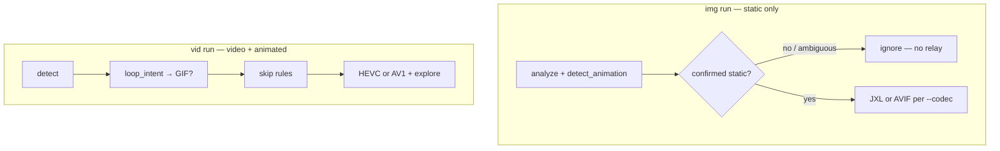

# Modern Format Boost


-E57324?style=for-the-badge&logo=rust&logoColor=white>)


**Next-gen media optimization engine — zero quality loss, maximum compression.**

[English](README.md) · [简体中文](docs/README_ZH.md) · [繁體中文](docs/README_ZH_TW.md) · [日本語](docs/README_JA.md) · [한국어](docs/README_KO.md) · [Español](docs/README_ES.md) · [Français](docs/README_FR.md) · [Português](docs/README_PT.md) · [Русский](docs/README_RU.md) · [العربية](docs/README_AR.md)

## What is Modern Format Boost?

**Modern Format Boost** is a high-performance, Rust-based media optimization
engine. It splits work by media domain:

- **`img`**: **static stills only** → **JXL** (`--codec hevc`) / **AVIF** (`--codec av1`); **verified animated** → **ignored** (run **`vid` separately**; img never relays)
- **Format ID**: magic bytes / content sniffing — extension mismatch is corrected or audited, **not** “`.gif` extension ⇒ animated”
- **Animation**: `detect_animation` + static proof — **true single-frame** GIF/WebP/APNG can stay on **`img`**
- **`vid`**: **video + animated raster** → **HEVC/AV1** (default **HEVC**)
- **`--codec hevc|av1`**: on **both** CLIs (default `hevc`) — on **`img`** means **JXL / AVIF stills**; on **`vid`** means **HEVC / AV1 video**. **No relay** between binaries.

Typical routes:

- 📸 **`img run`**: JPEG/PNG/lossless modern → JXL; lossy modern stills usually **skip**; JXL still **skip**; **GIF/WebP/APNG ignored**
- 🎬 **`vid run`**: H.264, animated WebP/GIF, etc. → HEVC/AV1 quality search; container from `--codec` and `--apple-compat`

Deep routing reference: [`docs/DELIVERY_STRATEGY_ROUTING.md`](docs/DELIVERY_STRATEGY_ROUTING.md).

Think of it as a conservative optimizer that prefers honest skip/ignore
outcomes over silent quality damage:

- 🍎 **Apple ecosystem first**: Full Apple compatibility mode, Live Photo
  detection, AAE sidecar handling
- 🔒 **Metadata guardian**: Preserves EXIF, XMP, ICC profiles, creation
  timestamps, macOS xattrs, Finder tags
- ⚡ **Perceived Speed Optimization**: "Deep-First" sorting strategy—prioritizes
  deeper directory levels first, then sorts by file size and format, to ensure
  efficient batching and maximum throughput.
- 🎞️ **HDR10+ Dynamic Metadata**: Full retention of SMPTE 2094-40 metadata via
  extraction sidecars and x265 SEI injection.
- 🌅 **HDR Gainmap Synthesis & Preservation**: Automatically synthesizes
  high-fidelity HDR JXL from HEIC and UltraHDR JPEG gainmaps while preserving
  non-embeddable auxiliary assets such as HEIC depth maps and raw UltraHDR
  gainmaps as sidecars.
- **🔍 Vendor Metadata Awareness**: Intelligent scanning for Samsung/Google
  specific XMP namespaces in HEIC files to ensure maximum context preservation.

## ⚠️ Disclaimer & Important Notes

1. **Data Safety First**: To avoid any potential data loss, it is highly
   recommended to output processed files to a separate directory (e.g., using
   `-o /path/to/output`) rather than using in-place conversion (`--in-place`),
   especially for irreplaceable media.
2. **Beta Software**: While this program has been extensively tested,
   debugged, and optimized to prevent quality or data loss (as seen in the
   changelog), it is not guaranteed to be 100% bug-free. Please report any
   issues you encounter on GitHub.
3. **Computation Insight**: While optimized for efficiency (especially on Apple
   Silicon M-series), processing massive batches in `--ultimate` mode can still
   be time-consuming. It will occupy system resources for an extended period;
   please plan your task accordingly.
4. **Tool Maturity**: The unified tools (`img`, `vid`) defaults to HEVC, which
   is more mature and stable than the AV1 strategy. For high-reliability
   production tasks, HEVC (the default) is recommended.

## 🔒 Privacy & Data Integrity

**Modern Format Boost** is built on a "Local-First" architecture, ensuring your
creative assets remain entirely within your control.

- **Air-Gapped Operation**: 100% offline processing. No telemetry, usage
  tracking, or cloud pings. The core binaries contain zero network-related code.
- **Rust-Hardened Runtime**: Built with Rust to natively eliminate memory
  corruption bugs (buffer overflows, etc.).
- **Secure Integration**: All external tools (FFmpeg, cjxl) are invoked via
  safe, escaped primitives—never through raw shell execution—preventing
  arbitrary command injection.
- **Path Isolation**: Advanced normalization prevents directory traversal and
  protects unrelated system files.
- **System Path Blocklist**: Built-in shields for sensitive system directories
  to prevent accidental OS file modifications.
- **Dynamic Resource Balancing**: Automatically adjusts processing threads based
  on memory/CPU load to prevent system crashes during extreme tasks.
- **Comprehensive Metadata Custodian**: Strict bit-for-bit preservation of EXIF,
  XMP, ICC, and file system timestamps (btime/mtime).
- **Secure Processing & Session Isolation**:
  - **Zero Workspace Pollution**: Centralized tracking (`~/.mfb_progress/`)
    keeps your media folders 100% clean. No hidden metadata files remain among
    your photos/videos.
  - **Conflict-Free Temp Files**: Every intermediate analysis file (YUV
    streams, analysis segments) is uniquely identified with a randomized UUID.
    This prevents multi-instance collisions and ensures "Surgical Precision"
    during cleanup.
  - **Scrub-on-Start Cleanup**: Whether a task completes successfully or is
    resumed after an interruption, the system automatically purges all
    transient data. This "Self-Cleaning" architecture ensures your disk remains
    free of abandoned processing leftovers.
  - **Intelligent Checkpoint Reset**: Automatically detects when a user
    manually deletes the output directory to "start over", triggering a full
    state reset even in resume mode.

## 🛠️ Deep Technical: How It Works — The Pipeline

### Image Pipeline Logic

Every file goes through a multi-stage decision pipeline:

- **Stage 1 — Smart Detection**: Analyzes JPEG DQT tables (UltraHDR gainmap
  detection), WebP VP8L chunks, and AVIF `av1C` boxes at binary level. Now
  features **Zero-Debt Architecture** with 100% Clippy compliance and robust
  `OpenEXR`/`JPEG 2000` header parsing.
- **Stage 2 — Route & Encode**: JXL VarDCT for JPEG (bit-exact); Modular mode
  for lossless sources (PNG, lossless WebP/AVIF/HEIC/EXR/JP2).
- **Stage 3 — Detour Pathway**: Formats like TIFF/WebP/BMP/HEIC are
  pre-processed into temporary 16-bit PNGs or **32-bit OpenEXR** to ensure
  `cjxl` compatibility without quality loss (8/16/32-bit matched pipeline).
- **Stage 4 — HDR Gainmap Synthesis**: Intercepts HEIC gainmap assets
  (Apple/Google) and UltraHDR JPEGs, synthesizes true HDR JXL output, and
  preserves non-embeddable auxiliary assets such as raw gainmaps/depth maps as
  sidecars.
- **Stage 5 — Static-only on `img`**: `img run` **ignores** animated assets
  (`IMG_ANIMATED_HANDOFF`). Use **`vid run`** for GIF/WebP/APNG and all video.
- **Stage 6 — Loop Intent v3**: Shared loop-intent logic decides whether
  animated media should stay GIF-like or proceed through the video pipeline.
  Apple-compat modern-animation delivery policy is centralized here.

### Video Pipeline: Three-Phase Saturation Search

1. **Phase 1: GPU Coarse Search**: Binary search on hardware encoders
   (VideoToolbox/NVENC) to find the "quality knee".
2. **Phase 2: CPU Fine-Tune**: Maps GPU CRF to `x265` scale. Uses **Sprint &
   Backtrack** (double step on success, reset to 0.1 on overshoot).
3. **Phase 3: Ultimate 3D Quality Gate**: Requires simultaneous pass of
   VMAF-Y ≥ 86.0 (sanity floor, dynamic baseline-relative), CAMBI ≤ 6.0
   (banding), and PSNR-UV ≥ 30.0 dB (chroma sanity floor).
   - **Fusion Scoring**: Combines MS-SSIM + SSIM_All (0.6/0.4 weight) for robust
     structural analysis.
   - **Chroma Guard**: Automatically detects small resolutions that would crash
     libvmaf MS-SSIM and falls back to Y-only scoring to ensure processing
     reliability.
   - _Note: In `--ultimate` mode, the search only terminates after
     **50 consecutive samples** show zero quality gain, ensuring absolute
     saturation._

### Metadata & HDR Preservation

- **HDR**: Preserves bt2020 primaries, PQ/HLG TRC, and Mastering Display
  metadata.
- **Dolby Vision**: Extracts RPU via `dovi_tool` and injects into x265
  (Profile 7 → 8.1 conversion).
- **macOS xattrs**: Preserves Finder Tags, Date Added, and creation timestamps
  via `copyfile` and `setattrlist`.

### 🖥️ Runtime


Runtime

### The Two Binaries

| Binary    | Input                   | Primary output     | `--codec hevc\|av1`                                   |
| --------- | ----------------------- | ------------------ | ----------------------------------------------------- |
| **`img`** | Static stills only      | JXL / AVIF / skip  | `hevc`→JXL, `av1`→AVIF (still only; ignores animated) |
| **`vid`** | Video + animated raster | MP4/MOV/GIF / skip | **Required surface** (default `hevc`)                 |

Plus a **double-click macOS app** (`Modern Format Boost.app`) for drag-and-drop
batch processing.

## Delivery strategy (HEVC / AV1)

Rust SSOT: [`crates/foundation/src/delivery_codec_strategy.rs`](crates/foundation/src/delivery_codec_strategy.rs).
Engineer reference: [`docs/DELIVERY_STRATEGY_ROUTING.md`](docs/DELIVERY_STRATEGY_ROUTING.md).

**`img run` and `vid run` both accept `--codec hevc|av1`** (default **`hevc`**), with **different meaning per binary**:

| Binary    | `--codec hevc`          | `--codec av1`                          |
| --------- | ----------------------- | -------------------------------------- |
| **`img`** | **JXL** batch (default) | **AVIF** still strategy (lossy branch) |
| **`vid`** | **HEVC** video delivery | **AV1** video delivery                 |

**`img`** only **encodes static stills**. It **never forwards** to **`vid`**; animated or ambiguous animatable files are **ignored** (`img_animated_handoff` = ignore-only audit token). **True single-frame** animatable files (verified GIF/WebP/APNG container, no cover-stream ambiguity) may stay on **`img`**. Not extension-only.

### Two layers

| Layer                                  | `img`        | `vid`        |
| -------------------------------------- | ------------ | ------------ |
| **Static still delivery** (JXL / AVIF) | ✅ `--codec` | —            |
| **Video delivery codec** (HEVC / AV1)  | ❌           | ✅ `--codec` |



### `img run`

| Input                                                                           | Action                                                                |
| ------------------------------------------------------------------------------- | --------------------------------------------------------------------- |
| Static JPEG / PNG / lossless modern / HDR gainmap                               | → **JXL** (or **AVIF** for lossy branch when `--codec av1`)           |
| Lossy modern still / JXL still                                                  | **Skip**                                                              |
| **Animated or unverified animatable** (GIF, WebP, **APNG**, AVIF, HEIC, JXL, …) | **Ignore** on `img` (process with **`vid run` separately** if needed) |

### `vid run` + `--codec hevc` (default)

| Stage               | What happens                                                                                                                                                                                                                                                                                     |
| ------------------- | ------------------------------------------------------------------------------------------------------------------------------------------------------------------------------------------------------------------------------------------------------------------------------------------------ |
| **Loop intent**     | GIF fast-path + `assess_loop_intent`; with `--apple-compat`, short modern animations may be forced to **stay GIF**; `--force` bypasses GIF routing.                                                                                                                                              |
| **Skip rules**      | Normal mode: already-HEVC often skipped; VP9/AV1/VVC skipped. Apple mode: VP9/AV1/VVC may be **converted to HEVC** instead of skipped.                                                                                                                                                           |
| **Lossless source** | `delivery_target(..., lossless=true)` → **HEVC lossless MKV** (archival).                                                                                                                                                                                                                        |
| **Lossy video**     | Target MP4 `hev1` or MOV `hvc1`; CRF from quality tier or explore; **`explore_hevc_with_gpu`** → x265 fine-tune; `--ultimate` → dual preset + 3D gate + slower final encode; HDR explore passes **`hdr_x265_params`**; Apple fallback may keep sub-target HEVC if size wins but SSIM gate fails. |

### `vid run` + `--codec av1`

| Stage               | What happens                                                                                                                                                       |
| ------------------- | ------------------------------------------------------------------------------------------------------------------------------------------------------------------ |
| **Loop / skip**     | Same loop-intent and skip policy until delivery.                                                                                                                   |
| **Lossless source** | Still routed to **HEVC lossless MKV** today (AV1 archival not implemented).                                                                                        |
| **Lossy video**     | **MP4 `av01` only**; **`explore_av1_with_gpu`** + SVT; **no** `--apple-compat`; already-AV1 sources may skip in normal mode; no x265 HDR merge on explore request. |

### Shared flags (`vid` video / animated paths)

| Flag              | HEVC                                                   | AV1                                       |
| ----------------- | ------------------------------------------------------ | ----------------------------------------- |
| `--explore`       | GPU HEVC coarse + x265 fine                            | GPU AV1 + libsvtav1                       |
| `--match-quality` | Quality-matched CRF search                             | Same                                      |
| `--ultimate`      | 3D gate + **faster preset search → slower x265 final** | SVT explore preset (no dual-preset final) |
| `--apple-compat`  | MOV `hvc1`, GIF policy, VP9/AV1→HEVC                   | **CLI error** — use `hevc`                |
| `--use-gpu`       | VideoToolbox / NVENC                                   | AV1 GPU coarse where available            |

### Policy comparison

| Policy                    | HEVC                                       | AV1                     |
| ------------------------- | ------------------------------------------ | ----------------------- |
| Default CLI               | yes                                        | `--codec av1`           |
| Container                 | MP4 (`hev1`) or MOV (`hvc1` + Apple)       | MP4 (`av01`) only       |
| CPU encoder               | `libx265`                                  | `libsvtav1`             |
| Ultimate explore          | Dual preset (faster search → slower final) | Single SVT preset path  |
| HDR (DV/HDR10+)           | x265 merge on explore                      | Not on AV1 explore path |
| Warm-start CRF            | Global HEVC hit cache                      | Global AV1 hit cache    |
| Lossless archival (`vid`) | HEVC MKV                                   | Still HEVC MKV today    |

## 📉 Real-World Compression Examples

| Input Format     | Original Size | Output Format  | Output Size | Savings  | Method                            |
| :--------------- | :------------ | :------------- | :---------- | :------- | :-------------------------------- |
| Landscape JPEG   | 4.2 MB        | **JXL**        | 3.3 MB      | **~21%** | Lossless component reconstruction |
| Screenshot PNG   | 2.5 MB        | **JXL**        | 1.1 MB      | **~56%** | Modular d=0.0                     |
| Action Cam H.264 | 1.2 GB        | **HEVC**       | 480 MB      | **~60%** | GPU/CPU CRF Search                |
| Animated WebP    | 15 MB         | **AV1 / HEVC** | 1.8 MB      | **~88%** | Transcoded to video format        |

## 📊 Processing Matrix

### Image Format Decision Matrix

| Input Format                                   | Static? | Action in `img run`       | Output        | Notes                                          |
| :--------------------------------------------- | :-----: | :------------------------ | :------------ | :--------------------------------------------- |
| JPEG                                           |   ✅    | **Lossless reconstruct**  | `.jxl`        | Bit-exact `cjxl --lossless_jpeg=1`             |
| PNG / TIFF / BMP / other lossless stills       |   ✅    | **Lossless convert**      | `.jxl`        | May use detour pathway first                   |
| WebP / AVIF / HEIC / HEIF (lossless still)     |   ✅    | **Convert**               | `.jxl`        | Lossless modern stills are allowed             |
| HEIC / HEIF with Gainmap                       |   ✅    | **HDR synthesis**         | `.jxl`        | Gainmap path synthesizes linear HDR            |
| Legacy lossy stills after static validation    |   ✅    | **Near-lossless convert** | `.jxl`        | Current `img run` batch path stays JXL-focused |
| Lossy WebP / AVIF / HEIC / HEIF still          |   ✅    | **Skip**                  | keep original | Avoid generational loss                        |
| JXL still                                      |   ✅    | **Skip**                  | keep original | Already optimal                                |
| Animated GIF / WebP / APNG / HEIC / HEIF / JXL |   ❌    | **Ignore on img**         | —             | Use **`vid run`** → `.mp4` / `.mov`            |

### `img` entrypoints

| Entry                 | Static output                                             | Animated      | AVIF                       |
| --------------------- | --------------------------------------------------------- | ------------- | -------------------------- |
| **`img run`**         | JXL (`--codec hevc`) or AVIF lossy branch (`--codec av1`) | **Ignored**   | `--codec av1` only         |
| **`smart_convert()`** | JXL or AVIF per `determine_strategy`                      | Domain ignore | Some lossy non-JPEG stills |

### Animated Media Decision Matrix (`vid` only)

| Input Format                                        | Owner                 | Action                | Output          | Notes                              |
| :-------------------------------------------------- | :-------------------- | :-------------------- | :-------------- | :--------------------------------- |
| GIF                                                 | `vid`                 | **Loop-intent route** | `.gif` or video | `--apple-compat` policy            |
| Animated WebP / AVIF / APNG / HEIC / HEIF / JXL     | `vid`                 | **HEVC/AV1 delivery** | `.mp4` / `.mov` | `animated_image` + `--codec`       |
| Short silent modern animation with `--apple-compat` | `vid` + `loop_intent` | **Force GIF**         | `.gif`          | Duration `<= 6s`                   |
| Long modern animation with `--apple-compat`         | `vid` + `loop_intent` | **Do not force GIF**  | video target    | Duration `>= 15s` stays video-like |
| Uncertain modern animation with `--apple-compat`    | `vid` + `loop_intent` | **Force GIF**         | `.gif`          | Compatibility fallback             |

### Video Codec Decision Matrix

| Input Codec                    | Normal Mode           | `--apple-compat` Mode | Notes                                                |
| :----------------------------- | :-------------------- | :-------------------- | :--------------------------------------------------- |
| H.264 (AVC)                    | **Convert**           | **Convert**           | Not pre-skipped in either mode                       |
| VP9                            | **Skip**              | **Convert to HEVC**   | Apple-incompatible source                            |
| AV1                            | **Skip**              | **Convert to HEVC**   | Apple-incompatible source                            |
| VVC / AV2                      | **Skip**              | **Convert to HEVC**   | Apple-incompatible source                            |
| HEVC (H.265)                   | **Skip**              | **Skip**              | Already Apple-native target                          |
| ProRes / DNxHD / legacy codecs | **Convert as needed** | **Convert as needed** | Final keep/skip still depends on optimization result |

Quality and size gates still apply after routing. In `--ultimate` and other
quality-matching flows, a route that is eligible for conversion may still end as
skip if the produced file fails quality/size requirements and no allowed
best-effort fallback applies.

### HDR Format Strategy

| HDR Type          | Detection                                | Preservation Strategy                                                                                         |
| :---------------- | :--------------------------------------- | :------------------------------------------------------------------------------------------------------------ |
| **HDR10**         | mastering_display + max_cll in side_data | Static metadata fully preserved via FFmpeg args                                                               |
| **HEIC Gainmap**  | HEIC auxiliary image (Apple/Samsung/ISO) | Synthesized to 32-bit linear HDR -> JXL (True HDR)                                                            |
| **UltraHDR JPEG** | JPEG APP1/APP2 + XMP (hdrgm:)            | Synthesized to true HDR JXL; raw gainmap preserved as `.gainmap.jpg`; `hdrgm` metadata bridged for provenance |
| **HLG**           | color_trc = arib-std-b67                 | Color primaries + TRC preserved                                                                               |
| **Dolby Vision**  | DOVI side_data in streams/frames         | RPU extraction via `dovi_tool` → x265 injection; Profile 7 → 8.1 conversion                                   |
| **HDR10+**        | ST2094-40 dynamic metadata               | Supported via `hdr10plus_tool` sidecar extraction and x265 injection (Profile A/B metadata retention)         |
| **SDR**           | No HDR markers                           | Standard processing (yuv420p)                                                                                 |

## ⬇️ Installation

### Pre-compiled Binaries

For users who do not wish to install the Rust toolchain, you can download
pre-compiled binaries from the
**[Releases](https://github.com/nowaytouse/modern-format-boost/releases)** page.

```bash
# macOS/Linux One-liner (example for macOS ARM64)
curl -LO https://github.com/nowaytouse/modern-format-boost/releases/latest/download/modern-format-boost-aarch64-apple-darwin.tar.gz
tar -xzf modern-format-boost-aarch64-apple-darwin.tar.gz
```

### Prerequisites

| Tool                 | Required? | Purpose                     | Install Command                                                                             |
| :------------------- | :-------: | :-------------------------- | :------------------------------------------------------------------------------------------ |
| **Rust** (nightly)   |    ✅     | Build & Install             | `curl --proto '=https' --tlsv1.2 -sSf https://sh.rustup.rs \| sh && rustup default nightly` |
| **FFmpeg** (5.0+)    |    ✅     | Video processing & Metrics  | `brew install ffmpeg` / `apt install ffmpeg`                                                |
| **libjxl**           |    ✅     | JXL encoding core           | `brew install jpeg-xl`                                                                      |
| **ExifTool**         |    ✅     | Metadata preservation       | `brew install exiftool`                                                                     |
| **ImageMagick**      |    ✅     | Image detour pathway        | `brew install imagemagick`                                                                  |
| **libwebp**          |    ✅     | WebP native decoding        | `brew install webp`                                                                         |
| **libheif**          |    ✅     | HEIC/HEIF decode            | `brew install libheif`                                                                      |
| **PostgreSQL** (12+) |    ✅     | Cache & quality database    | `brew install postgresql pgvector` / `apt install postgresql`                               |
| **dovi_tool**        | Optional  | Dolby Vision RPU extraction | `cargo install dovi_tool`                                                                   |
| **hdr10plus_tool**   | Optional  | HDR10+ metadata extraction  | `cargo install hdr10plus_tool`                                                              |

#### macOS (Homebrew)

```bash
brew install ffmpeg jpeg-xl exiftool imagemagick webp libheif postgresql pgvector
# Optional (for Dolby Vision / HDR10+ sources):
# cargo install dovi_tool hdr10plus_tool
```

> [!TIP]
> For power users who want all advanced features (AI filters, FDK-AAC, etc.),
> see
> our [Advanced FFmpeg Setup Guide](docs/FFMPEG_SETUP.md) for instructions on
> installing a full-featured version without breaking system dependencies.

#### Linux (Ubuntu/Debian)

```bash
sudo apt update && sudo apt install ffmpeg libimage-exiftool-perl imagemagick \
  webp libheif-dev postgresql postgresql-contrib postgresql-server-dev-all
# pgvector must be compiled and installed on Linux:
git clone --branch v0.5.1 https://github.com/pgvector/pgvector.git
cd pgvector
make && sudo make install
# JPEG XL (libjxl) may need PPA or source build on older distros
```

#### Windows

Recommended: Use **winget** for one-liner installation:

```powershell
winget install ffmpeg.ffmpeg ImageMagick.ImageMagick OliverBetz.ExifTool \
  libheif.libheif Google.WebP PostgreSQL.PostgreSQL
# Note: Copy pgvector binaries to your PostgreSQL folder. See https://github.com/pgvector/pgvector
# Optional (for Dolby Vision / HDR10+ sources):
# cargo install dovi_tool hdr10plus_tool
```

### 🗄️ Database Setup

Modern Format Boost utilizes PostgreSQL (with the `pgvector` extension) as a mandatory, local cache and quality-inference engine. Both `img` and `vid` binaries connect to the database on startup and will fail if the database service is unreachable.

#### 1. Start PostgreSQL Service

- **macOS**: `brew services start postgresql`
- **Linux**: `sudo systemctl start postgresql`

#### 2. Create the Database

The default database name is `modern_format_boost`. Create it before running the tools:

```bash
createdb modern_format_boost
```

Or via SQL:

```sql
CREATE DATABASE modern_format_boost;
```

_Note: The application automatically initializes the required schemas, tables, and enables the `vector` extension upon the first successful connection. No manual SQL migrations are needed for initialization._

## ⚙️ Environment Variables & Tuning

Customize execution parameters by setting the following environment variables:

| Variable             | Default Value                                | Description                                                                |
| :------------------- | :------------------------------------------- | :------------------------------------------------------------------------- |
| `MFB_PG_CONNSTR`     | `postgresql://localhost/modern_format_boost` | Connection string for the PostgreSQL server.                               |
| `MFB_HOME_ROOT`      | `~/.modern_format_boost`                     | Config root path and persistent training data folder.                      |
| `MFB_LOG_DIR`        | `~/.modern_format_boost/logs`                | Folder for session and tool logs (cannot be under the git workspace).      |
| `MFB_PERF_TIER`      | (Auto-detected)                              | Threading/fan-out schedule: `relaxed`, `balanced`, or `tight`.             |
| `MFB_LOW_MEMORY`     | `0` (false)                                  | Set to `1` to force the governor to operate in `tight` resource tier.      |
| `MFB_MULTI_INSTANCE` | `0` (false)                                  | Set to `1` to downscale resource ceilings under multi-instance contention. |

### ⚡ Performance Governor Scheduler (SSOT)

MFB employs a live memory governor to dynamically adjust parallel batch sizes and thread allocations based on memory pressure. It operates in three tiers:

- **`relaxed`**: Max headroom mode with high parallelism caps. Enabled when system memory pressure is low.
- **`balanced`**: Default mode balancing throughput and resource footprints.
- **`tight`**: Strict mode with capped concurrency and higher reserved CPU cores. Triggered automatically under high memory pressure or when available system memory falls below **2304 MB** or available RAM ratio is below **24%** (`PREEMPTIVE_TIGHT` guards).

### Build from Source

```bash
git clone https://github.com/nowaytouse/modern-format-boost.git
cd modern-format-boost
cargo build --release

```

## 🚀 Usage

### Quick Start

```bash
# Static stills → JXL (animated files in tree are ignored)
img run /path/to/media

# Video + animated raster (HEVC default)
vid run /path/to/media

# AV1 delivery
vid run --codec av1 /path/to/media

# Preview strategy for one file
vid strategy --codec hevc /path/to/video.mp4
```

### ⚡ Fastmode & Smart Resumption

The **Fast Img Flow** (`fastmode`) is tailored for drag-and-drop UI workflows (`cargo run --locked -p dev --bin drag_and_drop_processor`). It brings high-reliability resumption capabilities:

- **`WorkingCopyMarker` State Management**: Safely tracks partial process status across closures.
- **Stale Source Detection**: Automatically detects if the original files drift (count or hash mismatch) and forces a fresh rebuild, avoiding dirty retries.
- **Fail-Closed Retries**: Deep context capture and `Blake3` verification guarantee zero file corruption during interrupted `img run` scenarios.

### Detailed Options

- `--ultimate`: Archival-grade **0.01 precision** search (High quality, high
  time cost).
- `--archive`: Hard-overrides encoder speed settings for maximum compression:
  JPEG→JXL uses `cjxl` effort 11, other JXL encodes use effort 10, HEVC uses
  `veryslow`, and AV1 uses the slowest supported SVT preset.
- `--apple-compat`: Enable Apple ecosystem compatibility (Live Photos/AAE).
  CLI default is on; `--no-apple-compat` disables it.
- `--in-place`: Replace original files. **WARNING: IRREVERSIBLE.**
- `-o /dir`: Safe output directory. (Recommended)
- `--verbose`: Show detailed processing logs.
- `--no-recursive`: Do not descend into subdirectories.
- `--force-video`: Force treat animated images as video regardless of Loop
  Intent.

### Advanced Subcommands

- `img cache-stats`: View SQLite analysis cache statistics.
- `vid strategy <file>`: Preview the pipeline strategy for a specific file.
- `img restore-timestamps`: Bulk fix creation dates based on filename patterns
  (metadata recovery).

### 💡 Multi-Instance Note

**Modern Format Boost** natively supports running multiple windows/instances.

- **Concurrent Processing**: Allows running multiple windows to handle different
  paths independently.
- **Note**: Please scale according to your hardware I/O performance; excessive
  concurrency may cause file system race conditions.

## 🏗️ Architecture

### CI/CD and Quality Gates

Modern Format Boost uses a strict quality gating system to guarantee a zero-debt architecture:

- **Rust-First Tooling**: Engineering entrypoints are Rust bins under `crates/dev/src/bin`; Python originals are retained only as compatibility references until their safe-delete status is confirmed.
- **Local CI Verification**: Before submitting patches, you must use `just fix-gate` or `cargo run --locked -p dev --bin check_all -- --allow-non-nightly`. This serves as the Single Source of Truth (SSOT) for code formatting, static analysis, and automated testing.
- **Test Hardening & Stability**: "Fail Fast" is disabled in CI to collect comprehensive diagnostic information across all platforms. Critical paths (e.g., JPEG recovery proofs) are instrumented with deep context capture for error states.

### Core Structure

- `crates/img/`: Static image optimizer (`JXL` / skip / ignore in the current CLI path)
- `crates/vid/`: Video and animated-media optimizer (`HEVC` / `AV1` / `GIF`)
- `crates/foundation/`: Core brain (GPU/CPU hybrid engine, HDR mapping,
  metadata)
- `Modern Format Boost.app/`: macOS drag-and-drop UI

## 📐 Layer contracts & training

Runtime behavior for delivery, inference, UI, and training is documented as
**fail-closed contracts** (enforced in CI). Use these when extending `img` /
`vid`, exploration, or the PostgreSQL training stack.

| Layer                              | Document                                                                                                                                                                  |
| ---------------------------------- | ------------------------------------------------------------------------------------------------------------------------------------------------------------------------- |
| **System SSOT & Audits**           | [`.agents/harding/SSOT.md`](.agents/harding/SSOT.md) (Unified source of truth replacing fragmented audit docs)                                                            |
| Media conversion delivery (M1–M66) | [`docs/MEDIA_CONVERSION_LAYER_CONTRACT.md`](docs/MEDIA_CONVERSION_LAYER_CONTRACT.md) · [`docs/MEDIA_CONVERSION_DELIVERY_SEAL.md`](docs/MEDIA_CONVERSION_DELIVERY_SEAL.md) |
| Algorithm / inference gates        | [`docs/ALGORITHM_LAYER_CONTRACT.md`](docs/ALGORITHM_LAYER_CONTRACT.md)                                                                                                    |
| Terminal UI                        | [`docs/UI_LAYER_CONTRACT.md`](docs/UI_LAYER_CONTRACT.md)                                                                                                                  |
| Logging / session                  | [`docs/LOGGING_LAYER_CONTRACT.md`](docs/LOGGING_LAYER_CONTRACT.md)                                                                                                        |
| Database / multi-scenario          | [`docs/DATABASE_LAYER_CONTRACT.md`](docs/DATABASE_LAYER_CONTRACT.md) · [`docs/MULTI_SCENARIO_IMPLEMENTATION_GUIDE.md`](docs/MULTI_SCENARIO_IMPLEMENTATION_GUIDE.md)       |

**Static image quality training** (high/low tiers, ingest audit):

- **Entry**: `python3 crates/dev/scripts/run_training.py` remains the active training-lane entry while current batch jobs finish; do not delete it until Rust parity is confirmed.
- **Rules**: committed [`training_rules.json`](crates/dev/src/config/training_rules.json); machine `local_dirs` / ingest caps in gitignored `training_rules.local.json`.
- **Tier engine**: Rust [`training_tier_audit.rs`](crates/foundation/src/train/training_tier_audit.rs) mirrors JSON thresholds (entropy dead zone, geometry guards).
- **Background**: `python3 crates/dev/scripts/run_training.py --background` → logs under the unified log directory (see `docs/LOGGING_LAYOUT.md`).

See [`docs/CHANGELOG.md`](docs/CHANGELOG.md) **0.11.3** for the full hardening notes.

Full doc map: [`docs/DOCUMENTATION_INDEX.md`](docs/DOCUMENTATION_INDEX.md).

## ❓ FAQ

**1. Is JXL broadly supported?**
Native support exists in macOS 14+ / iOS 17+, Chrome 91+, and Firefox 128+.
However, there are known ecosystem issues:

- **Animations**: Modern animated formats (JXL/AV1/HEIF) often fail to preview
  as animations in the native macOS/iOS Photos app or Finder (static only),
  especially when synchronized via iCloud. They play correctly in modern
  browsers or specialized tools.
- **Thumbnails**: JXL files using **grayscale ICC profiles** may appear as
  **black thumbnails** in Finder/iCloud, even though they render perfectly when
  opened.
  JXL remains the superior format for bit-exact archival and high-fidelity HDR
  storage.

**2. How is HDR10+ handled?**
Fully supported. We use `hdr10plus_tool` to extract SMPTE 2094-40 dynamic
metadata and inject it back into the HEVC stream via `libx265`'s
`--dhdr10-info` parameter. Ensure the tool is installed to enable this feature.

**3. Why skip WebP/AVIF/HEIC?**
Static lossy WebP/AVIF/HEIC/HEIF are usually skipped because they are already
modern lossy formats, and re-encoding them would risk generational loss for
small benefit. Important exceptions in the current code are:

- lossless modern stills can still be converted to JXL
- HEIC/HEIF gainmap assets can be synthesized into HDR JXL
- UltraHDR JPEGs are synthesized into HDR JXL and keep the embedded gainmap as
  a raw `.gainmap.jpg` sidecar for audit/round-trip recovery
- animated modern formats are not handled by `img`; they are routed through
  `vid` and `loop_intent`

---

## ⚖️ License

Licensed under the **MIT License**.

## Runtime Dependencies

This project orchestrates several open-source giants. We thank their authors for
their contributions:

| Component              | License    | Purpose                    |
| ---------------------- | ---------- | -------------------------- |
| **FFmpeg**             | LGPL/GPL   | Video processing & Metrics |
| **libjxl** (cjxl/djxl) | BSD-3      | JPEG XL encoding           |
| **ExifTool**           | Perl/GPL   | Metadata preservation      |
| **ImageMagick**        | Apache 2.0 | Image detour pathway       |
| **SVT-AV1**            | BSD+Patent | AV1 Encoding               |
| **x265**               | GPL-2.0    | HEVC Encoding              |

All Rust dependencies are managed via `Cargo.toml` and fall under their
respective open-source licenses (MIT/Apache/BSD).
