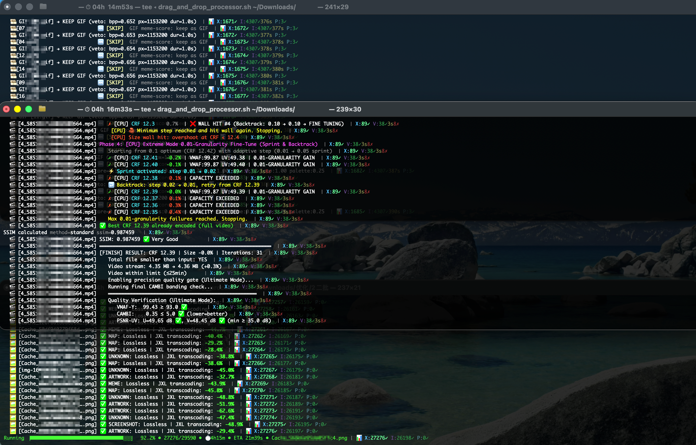

# Modern Format Boost


-E57324?style=for-the-badge&logo=rust&logoColor=white>)


**以证据驱动媒体焕新：保留源语义、核验最终交付、无法证明时失败关闭。**

[English](../README.md) · [简体中文](README_ZH.md)

## 什么是 Modern Format Boost？

**Modern Format Boost** 是一个基于 Rust 的媒体格式焕新工具，按媒体领域明确分工：

- **`img run`**：只处理静态图片，普通路径只交付 **JXL**。默认使用本地精确检测；只有显式开启可选质量启发功能时才查询 PostgreSQL。
- **`img fast-img --strategy jxl`**：真实 JPEG → 可逐字节重建的 JXL；确认有损的现代静态格式可进入独立的 Apple Photos 托管路径。
- **`img fast-img --strategy avif`**：面向已整理表情包的 Meme Mode，使用 AVIF 搜索并清理元数据；这是明确的破坏性策略。
- **`vid run`**：拥有视频与动图的 HEVC/AV1 交付。`img` 不会静默转发或代跑 `vid`。
- **格式识别**：文件头、容器结构与动画证据优先于扩展名；扩展名不决定真实媒体类型。

典型路线：

- 📸 **`img run`**：静图 → JXL；有损现代静图/**跳过**；**动图忽略**
- ⚡ **`img fast-img --strategy jxl`**：真实 JPEG → 永久可逆 JXL；只有最终重建闸门通过后才允许删除源 JPEG
- 🧩 **`img fast-img --strategy avif`**：确认静态的图片容器 → AVIF Meme Mode 搜索
- 🎬 **`vid run`**：H.264、动图 WebP/GIF 等 → HEVC/AV1；由 `--codec` 与 `--apple-compat` 决定

路由实现来源：[`delivery_codec_strategy.rs`](../crates/foundation/src/convert/delivery_codec_strategy.rs)。

### 项目保证什么，又不保证什么？

- 只有通过对应路径的解码、质量、元数据与完整性闸门，候选文件才会交付。受大小约束的路径比较的是编码媒体载荷；找不到符合策略的候选时，保留源文件并明确跳过或失败。
- JPEG→JXL 在所有元数据处理完成后仍必须通过 `djxl --reconstruct_jpeg` 逐字节重建。JBRD、原始 Exif/XMP 与编码数据会被冻结；外部 XMP 以可重复执行且不改写原始层的 overlay 追加，并再次核验精确重建。`restore-jpeg` 不再改写重建出的 JPEG；额外 XMP 会作为单独哈希核验的同名 `.xmp` 侧车交付，因为嵌入它就不可能同时保持原 JPEG 字节完全一致。
- Overlay 采用同目录唯一临时文件、源身份/哈希复核、原子替换与文件/父目录刷盘；版本化审计链记录 JBRD、overlay、最终容器与重建哈希但不记录媒体内容。完整规则见 [`JXL_XMP_ARCHIVE_CONTRACT.md`](hardening/JXL_XMP_ARCHIVE_CONTRACT.md)。
- 项目不是“魔法缩容器”。完整文件可能因容器与元数据而更大，高质量候选也可能没有任何空间收益。
- 探索以时间换取更精确的候选：目标是在有效质量/大小策略内寻找最高质量点，而不是无条件得到最小文件。输入越多、越复杂、差异越大，耗时越高；`--ultimate` 会主动扩大搜索成本。

### 谁适合使用？

实机覆盖最充分的是 macOS、Apple 生态媒体库与显式 Photos 交付。Linux/Windows 仍可使用相邻输出和本地转换，但 Photos、TCC 与 iCloud 托管核验仅限 macOS，非 Apple 平台的生产实测覆盖目前较少。任何平台处理不可替代的档案前都应保留独立备份。

### 为什么开发这个项目？

多数一次性转换器会把同一套质量、努力值和速度策略应用到所有文件。Modern Format Boost 将每个媒体视为独立的搜索与交付决策：投入更多时间寻找满足当前大小/质量策略的候选，然后在清理源文件前核验元数据与完整性。额外耗时是有意设计；项目不会用“更快”或“更小”代替可审计的可信结果。

数据库、训练和质量门禁等较大的工程面用于让决策可检查，并捕获静默回退。可选系统仍然保持可选：普通 `img run`、FastImg 与 JPEG 恢复默认使用精确的本地分析；只有明确选择对应命令或选项时才使用 PostgreSQL 与学习型质量启发式。项目欢迎更多平台的生产证据，尤其是目前实机覆盖较少的 Linux 与 Windows 路径。

可以将其视为一个保守的优化器，宁愿选择诚实的跳过/忽略结果，也不愿造成隐性的质量损坏：

- 🍎 **苹果生态优先**：全苹果兼容模式、实况照片 (Live Photo) 检测、AAE 挂载文件处理。
- 🔒 **元数据守护者**：保留 EXIF、XMP、ICC 配置文件、创建时间戳、macOS xattrs、Finder 标签。
- ⚡ **感知速度优化**：“深度优先”排序策略——优先处理目录层级较深的文件，然后按文件大小和格式排序，以确保高效的批量处理和最大吞吐量。
- 🎞️ **HDR10+ 动态元数据**：通过提取挂载文件和 x265 SEI 注入，实现 SMPTE 2094-40 元数据的完整保留。
- 🌅 **HDR 增益图保留**：HEIC 增益图可合成高保真 HDR JXL，并将无法内嵌的深度图等辅助资产作为 sidecar 保留。UltraHDR JPEG 默认走精确 JPEG 归档路径，完整保留可逐字节重建的 MPF/增益图容器。
- **🔍 厂商元数据识别**：智能扫描 HEIC 文件中三星/谷歌特定的 XMP 命名空间，以确保最大程度的上下文保留。

## ⚠️ 免责声明与重要提示

1. **数据安全第一**：为避免任何潜在的数据丢失，强烈建议将处理后的文件输出到单独的目录（例如，使用 `-o /path/to/output`），而不是使用原地转换 (`--in-place`)，特别是对于不可替代的媒体。
2. **测试版软件**：虽然该程序已经过广泛的测试、调试和优化以防止质量或数据丢失（详见更新日志），但不能保证 100% 无错误。请在 GitHub 上报告您遇到的任何问题。
3. **计算洞察**：虽然针对效率进行了优化（尤其是在苹果 M 系列芯片上），但在 `--ultimate` 模式下处理大规模批处理仍可能耗时较长。它将长时间占用系统资源；请相应地规划您的任务。
4. **命令语义不同**：普通 `img run` 只接受 `hevc`→JXL；FastImg AVIF 用 `--strategy avif`；只有 `vid run` 的 `hevc|av1` 表示视频编码器。不要跨命令推断参数语义。

## 🔒 隐私与数据完整性

**Modern Format Boost** 构建在“本地优先”架构之上，确保您的创意资产完全在您的控制之下。

- **本地媒体处理**：转换与核验不上传媒体、没有遥测；安装依赖、下载工具和 CI 本身仍可能访问网络。
- **Rust 加固运行时**：Rust 消除了大量内存不安全代码类别；路径边界、解析上限与交付闸门继续处理逻辑和外部工具风险。
- **安全集成**：所有外部工具（FFmpeg、cjxl）都通过安全的、转义的原语调用——绝不通过原始 shell 执行——从而防止任意命令注入。
- **路径隔离**：先进的规范化处理可防止目录遍历，并保护无关的系统文件。
- **系统路径黑名单**：内置敏感系统目录屏蔽，防止意外修改操作系统文件。
- **动态资源平衡**：根据内存/CPU 负载自动调整处理线程，防止极端任务期间系统崩溃。
- **元数据托管**：按目标格式能力保留或显式规范化 EXIF、XMP、ICC、时间戳与 macOS 扩展属性；项目不宣称所有容器的元数据都能逐位复制。
- **安全处理与会话隔离**：
  - **受控状态目录**：集中式进度状态位于 `~/.mfb_progress/`；相邻工作副本和用户明确选择的输出仍会出现在媒体目录旁。
  - **无冲突临时文件**：每个中间分析文件（YUV 流、分析分段）都使用随机 UUID 进行唯一标识。这可以防止多实例碰撞，并确保清理时的“手术级精度”。
  - **有界清理**：可丢弃的中间文件会清理；用于显式恢复与身份核验的持久状态会保留，不会把“发现状态”当作静默恢复或删除源文件的许可。
  - **智能检查点重置**：自动检测用户何时手动删除输出目录以“重新开始”，即使在恢复模式下也会触发完整的状态重置。

## 🛠️ 技术深入：工作流程 —— 流水线

### 图像流水线逻辑

每个文件都会经过多阶段决策流水线：

- **阶段 1 — 精确检测**：通过文件头、容器结构与权威工具证据识别 JPEG、WebP、AVIF、HEIC、JP2 等格式；无法证明有损/无损或静态/动画语义时失败关闭。
- **阶段 2 — 路由与编码**：JPEG 只接受能逐字节重建的 JXL 转码；已证明无损的源可走无损 JXL；已是有损现代静态格式的源通常原样保留。
- **阶段 3 — 异常媒体路径**：普通 IMG 可对非 JPEG 的解码器敌对格式使用受控预处理；JPEG 不以像素相等或重新编码冒充可逆转码，FastImg JXL 也不使用破坏性兜底。
- **阶段 4 — HDR 增益图处理**：HEIC 增益图资产可合成真实 HDR JXL，并将无法内嵌的深度图/增益图作为 sidecar 保留。UltraHDR JPEG 则通过 JBRD 归档，原始 JPEG（包括 MPF 增益图与私有元数据）必须逐字节重建。显式 UltraHDR 像素合成属于不可归档操作，不会被删除源文件或强交付路径自动采用。
- **阶段 5 — img 仅静图**：`img run` 对**已验证动图** **ignore**（`IMG_ANIMATED_HANDOFF`）；**真单帧** GIF/WebP 等可走 JXL；其余动图与所有视频请用 **`vid run`**。
- **阶段 6 — 循环意图 v3**：共享的循环意图逻辑决定动画媒体是保持类似 GIF 的状态还是进入视频流水线。苹果兼容的现代动画交付策略在此集中管理。

### 视频流水线：三阶段饱和搜索

1. **阶段 1：GPU 粗略搜索**：在硬件编码器（VideoToolbox/NVENC）上进行二分搜索，以找到“质量拐点”。
2. **阶段 2：CPU 精细调节**：将 GPU CRF 映射到 `x265` 等级。使用 **冲刺与回溯 (Sprint & Backtrack)**（成功时双倍步长，超出时重置为 0.1）。
3. **阶段 3：终极 3D 质量闸门**：要求同时通过 VMAF-Y ≥ 86.0（基准线，动态关联）、CAMBI ≤ 6.0（色带）和 PSNR-UV ≥ 30.0 dB（色度基准线）。
   - **融合评分**：结合 MS-SSIM + SSIM_All（权重 0.6/0.4）进行稳健的结构分析。
   - **色度防护**：自动检测可能导致 libvmaf MS-SSIM 崩溃的小分辨率，并回退到仅 Y 评分，以确保处理可靠性。
   - _注：在 `--ultimate` 模式下，只有在 **连续 50 个样本** 显示零质量增益后，搜索才会终止，确保绝对饱和。_

### 元数据与 HDR 保留

- **HDR**：保留 bt2020 原色、PQ/HLG TRC 和母带显示元数据。
- **杜比视界 (Dolby Vision)**：通过 `dovi_tool` 提取 RPU 并注入 x265（Profile 7 → 8.1 转换）。
- **macOS xattrs**：通过 `copyfile` 和 `setattrlist` 保留 Finder 标签、添加日期和创建时间戳。

### 🖥️ 运行状态



运行状态

### 两个二进制程序

| 二进制    | 输入        | 主要输出                      | `--codec hevc\|av1`                      |
| --------- | ----------- | ----------------------------- | ---------------------------------------- |
| **`img`** | 仅静图      | JXL / 跳过；FastImg Meme→AVIF | `img run` 仅 `hevc`→JXL；动图 **ignore** |
| **`vid`** | 视频 + 动图 | MP4/MOV/GIF / 跳过            | **有**（默认 `hevc`）                    |

此外还有一个 **macOS 双击应用** (`Modern Format Boost.app`)，用于拖放式批量处理。

## 交付策略（HEVC / AV1）

Rust SSOT：[`delivery_codec_strategy.rs`](../crates/foundation/src/convert/delivery_codec_strategy.rs)。

普通 `img run` 与 `vid run` 的 `--codec` **不是同一套语义**：

| 二进制    | `hevc`           | `av1`                              |
| --------- | ---------------- | ---------------------------------- |
| **`img`** | 静图批量 **JXL** | **拒绝**；请使用 FastImg Meme Mode |
| **`vid`** | 视频 **HEVC**    | 视频 **AV1**                       |

**`img` 只编码静图**，**不会**把文件交给 `vid` 处理。动图/无法确认仅静图 → **ignore**（审计类 `img_animated_handoff` 仅表示跳过，**不是转发**）。普通 IMG 中经多方验证的真单帧 GIF/WebP/APNG 只走 JXL；AVIF 输出仅属于 FastImg Meme Mode。**`vid`** 单独处理视频与动图（含 GIF、动图 WebP、**APNG**、动图 AVIF/HEIC 等）。

### 两层策略

| 层                                                 | `img` | `vid` |
| -------------------------------------------------- | ----- | ----- |
| **静图格式**（普通 IMG 为 JXL；Meme Mode 为 AVIF） | ✅    | —     |
| **视频交付编码**（HEVC/AV1）                       | ❌    | ✅    |

### `img run`（无 `--codec`）

| 输入                                    | 行为                                                               |
| --------------------------------------- | ------------------------------------------------------------------ |
| 静图 / **真单帧**可动画容器（多方验证） | → JXL                                                              |
| 动图 / 封面流歧义                       | **忽略**（需动图时请**另行**运行 **`vid run`**，img 不会自动转发） |

### `vid run` + `--codec hevc`（默认）

| 阶段         | 行为                                                                              |
| ------------ | --------------------------------------------------------------------------------- |
| **循环意图** | 可能保留 GIF（尤其 `--apple-compat` 短动画）；`--force` 可强制走视频。            |
| **跳过规则** | 普通模式常跳过已是 HEVC；Apple 模式可把 VP9/AV1 转为 HEVC 交付。                  |
| **无损源**   | HEVC 无损 MKV。                                                                   |
| **有损视频** | MP4/MOV + `explore_hevc_with_gpu` + x265；ultimate 双预设；HDR 探索带 x265 参数。 |

### `vid run` + `--codec av1`

| 阶段         | 行为                                                |
| ------------ | --------------------------------------------------- |
| **有损视频** | 仅 MP4 `av01` + AV1 探索；不支持 `--apple-compat`。 |
| **无损归档** | 当前仍走 **HEVC 无损 MKV**（AV1 归档未实现）。      |

### 共享标志（视频路径）

| 标志             | HEVC                 | AV1           |
| ---------------- | -------------------- | ------------- |
| `--explore`      | GPU HEVC + x265      | GPU AV1 + SVT |
| `--ultimate`     | 快搜 → 慢成片 x265   | SVT 单预设    |
| `--apple-compat` | MOV `hvc1`、GIF 策略 | **CLI 拒绝**  |

完整逐步表见本节及下方处理矩阵；运行时路由以 Rust SSOT 为准。

## 📉 真实世界压缩示例

| 输入格式       | 原始大小 | 输出格式       | 输出大小 | 节省     | 方法             |
| :------------- | :------- | :------------- | :------- | :------- | :--------------- |
| 风景 JPEG      | 4.2 MB   | **JXL**        | 3.3 MB   | **~21%** | 无损组件重建     |
| 截图 PNG       | 2.5 MB   | **JXL**        | 1.1 MB   | **~56%** | Modular d=0.0    |
| 运动相机 H.264 | 1.2 GB   | **HEVC**       | 480 MB   | **~60%** | GPU/CPU CRF 搜索 |
| 动画 WebP      | 15 MB    | **AV1 / HEVC** | 1.8 MB   | **~88%** | 转码为视频格式   |

## 📊 处理矩阵

### 图像格式决策矩阵

| 输入格式                                    | 静态？ | `img run` 中的动作 | 输出       | 备注                              |
| :------------------------------------------ | :----: | :----------------- | :--------- | :-------------------------------- |
| JPEG                                        |   ✅   | **无损重建**       | `.jxl`     | 位精确 `cjxl --lossless_jpeg=1`   |
| UltraHDR JPEG                               |   ✅   | **精确归档**       | `.jxl`     | 完整 MPF/增益图 JPEG 可逐字节重建 |
| PNG / TIFF / BMP / 其他无损静态图           |   ✅   | **无损转换**       | `.jxl`     | 可能先走迂回路径                  |
| WebP / AVIF / HEIC / HEIF / JP2 (无损静态)  |   ✅   | **转换**           | `.jxl`     | 允许转换无损现代静态图            |
| 带有增益图的 HEIC / HEIF                    |   ✅   | **HDR 合成**       | `.jxl`     | 增益图路径合成线性 HDR            |
| 静态验证后的遗留有损静态图                  |   ✅   | **近无损转换**     | `.jxl`     | 当前 `img run` 批量路径专注于 JXL |
| 有损 WebP / AVIF / HEIC / HEIF / JP2 静态图 |   ✅   | **跳过**           | 保留原文件 | 避免代际损失                      |
| JXL 静态图                                  |   ✅   | **跳过**           | 保留原文件 | 已经是最佳格式                    |
| 动画 GIF / WebP / APNG / HEIC / HEIF / JXL  |   ❌   | **img 忽略**       | —          | 请用 **`vid run`**                |

### `img` 入口

| 入口                               | 静图输出                                           | 动图        | AVIF                             |
| ---------------------------------- | -------------------------------------------------- | ----------- | -------------------------------- |
| **`img run`**                      | JXL（`hevc`）；现代有损源原样保留                  | **忽略**    | 不可用，`av1` 会被拒绝           |
| **`img fast-img --strategy jxl`**  | 真实 JPEG 可逆 JXL；已确认现代有损源进入验证交付层 | 保留/忽略   | 可作为原样交付的现代有损源       |
| **`img fast-img --strategy avif`** | AVIF Meme Mode                                     | 拒绝/保留   | 唯一 AVIF 编码入口               |
| **`smart_convert()`**              | JXL 或按 `determine_strategy` 原样保留             | 域外 ignore | 不可用，请使用 FastImg Meme Mode |

### 动画媒体决策矩阵（仅 `vid`）

| 输入格式                                    | 归属                  | 动作              | 输出            | 备注                         |
| :------------------------------------------ | :-------------------- | :---------------- | :-------------- | :--------------------------- |
| GIF                                         | `vid`                 | **循环意图**      | `.gif` 或视频   | `--apple-compat` 策略        |
| 动画 WebP / AVIF / APNG / HEIC / HEIF / JXL | `vid`                 | **HEVC/AV1 交付** | `.mp4` / `.mov` | `animated_image` + `--codec` |
| 带有 `--apple-compat` 的短无声现代动画      | `vid` + `loop_intent` | **强制 GIF**      | `.gif`          | 时长 `<= 6s`                 |
| 带有 `--apple-compat` 的长现代动画          | `vid` + `loop_intent` | **不强制 GIF**    | 视频目标        | 时长 `>= 15s` 保持视频风格   |
| 带有 `--apple-compat` 的不确定现代动画      | `vid` + `loop_intent` | **强制 GIF**      | `.gif`          | 兼容性回退                   |

### 视频编码决策矩阵

| 输入编码                  | 普通模式     | `--apple-compat` 模式 | 备注                            |
| :------------------------ | :----------- | :-------------------- | :------------------------------ |
| H.264 (AVC)               | **转换**     | **转换**              | 两种模式下都不会被预跳过        |
| VP9                       | **跳过**     | **转换为 HEVC**       | 苹果不兼容的源                  |
| AV1                       | **跳过**     | **转换为 HEVC**       | 苹果不兼容的源                  |
| VVC / AV2                 | **跳过**     | **转换为 HEVC**       | 苹果不兼容的源                  |
| HEVC (H.265)              | **跳过**     | **跳过**              | 已经是苹果原生目标              |
| ProRes / DNxHD / 遗留编码 | **按需转换** | **按需转换**          | 最终的保留/跳过仍取决于优化结果 |

路由后仍需通过质量和大小门槛。在 `--ultimate` 和其他质量匹配流程中，符合转换条件的路由如果生成的文件未通过质量/大小要求且没有允许的最佳实践回退，最终仍可能以跳过告终。

### HDR 格式策略

| HDR 类型          | 检测                                       | 保留策略                                                                              |
| :---------------- | :----------------------------------------- | :------------------------------------------------------------------------------------ |
| **HDR10**         | side_data 中的 mastering_display + max_cll | 通过 FFmpeg 参数完整保留静态元数据                                                    |
| **HEIC 增益图**   | HEIC 辅助图像 (苹果/三星/ISO)              | 合成为 32 位线性 HDR -> JXL (真实 HDR)                                                |
| **UltraHDR JPEG** | JPEG APP1/APP2 + XMP (hdrgm:)              | 默认精确归档为 JXL，完整 MPF/增益图 JPEG 可逐字节重建；显式像素合成仅允许非破坏性使用 |
| **HLG**           | color_trc = arib-std-b67                   | 保留原色 + TRC                                                                        |
| **杜比视界**      | 流/帧中的 DOVI side_data                   | 通过 `dovi_tool` 提取 RPU → x265 注入；Profile 7 → 8.1 转换                           |
| **HDR10+**        | ST2094-40 动态元数据                       | 通过 `hdr10plus_tool` 挂载提取和 x265 注入支持（保留 Profile A/B 元数据）             |
| **SDR**           | 无 HDR 标记                                | 标准处理 (yuv420p)                                                                    |

## ⬇️ 安装

### 预编译二进制文件

对于不想安装 Rust 工具链的用户，可以从 **[Releases](https://github.com/nowaytouse/modern-format-boost/releases)** 页面下载预编译的二进制文件。

```bash
# macOS/Linux 一键安装（以 macOS ARM64 为例）
curl -LO https://github.com/nowaytouse/modern-format-boost/releases/latest/download/modern-format-boost-aarch64-apple-darwin.tar.gz
tar -xzf modern-format-boost-aarch64-apple-darwin.tar.gz

```

### 前提条件

| 工具                 | 必需？ | 用途                            | 安装命令                                                                                    |
| :------------------- | :----: | :------------------------------ | :------------------------------------------------------------------------------------------ |
| **Rust** (nightly)   |   ✅   | 构建与安装                      | `curl --proto '=https' --tlsv1.2 -sSf https://sh.rustup.rs \| sh && rustup default nightly` |
| **FFmpeg** (5.0+)    |   ✅   | 视频处理与指标计算              | `brew install ffmpeg` / `apt install ffmpeg`                                                |
| **libjxl**           |   ✅   | JXL 编码核心                    | `brew install jpeg-xl`                                                                      |
| **ExifTool**         |   ✅   | 元数据保留                      | `brew install exiftool`                                                                     |
| **ImageMagick**      |   ✅   | 图像迂回路径                    | `brew install imagemagick`                                                                  |
| **libwebp**          |   ✅   | WebP 原生解码                   | `brew install webp`                                                                         |
| **libheif**          |   ✅   | HEIC/HEIF 解码                  | `brew install libheif`                                                                      |
| **PostgreSQL** (12+) |  按需  | Vid、训练、缓存及可选质量启发式 | `brew install postgresql pgvector` / `apt install postgresql`                               |
| **dovi_tool**        |  可选  | 杜比视界 RPU 提取               | `cargo install dovi_tool`                                                                   |
| **hdr10plus_tool**   |  可选  | HDR10+ 元数据提取               | `cargo install hdr10plus_tool`                                                              |

#### macOS (Homebrew)

```bash
brew install ffmpeg jpeg-xl exiftool imagemagick webp libheif postgresql pgvector
# 可选（用于杜比视界 / HDR10+ 源）：
# cargo install dovi_tool hdr10plus_tool
```

> [!TIP]
> 对于想要所有高级功能（AI 滤镜、FDK-AAC 等）的高级用户，请参阅我们的 [高级 FFmpeg 设置指南](FFMPEG_SETUP.md)，了解如何在不破坏系统依赖的情况下安装功能齐全的版本。

#### Linux (Ubuntu/Debian)

```bash
sudo apt update && sudo apt install ffmpeg libimage-exiftool-perl imagemagick \
  webp libheif-dev postgresql postgresql-contrib postgresql-server-dev-all
# Linux 下必须编译并安装 pgvector 扩展：
git clone --branch v0.5.1 https://github.com/pgvector/pgvector.git
cd pgvector
make && sudo make install
# JPEG XL (libjxl) 在旧发行版上可能需要 PPA 或源码构建
```

#### Windows

推荐：使用 **winget** 进行一键安装：

```powershell
winget install ffmpeg.ffmpeg ImageMagick.ImageMagick OliverBetz.ExifTool \
  libheif.libheif Google.WebP PostgreSQL.PostgreSQL
# 注意：将 pgvector 二进制文件拷贝至您的 PostgreSQL 目录下。参见 https://github.com/pgvector/pgvector
# 可选（用于杜比视界 / HDR10+ 源）：
# cargo install dovi_tool hdr10plus_tool
```

### 🗄️ 数据库设置

Modern Format Boost 使用 PostgreSQL（并启用 `pgvector` 扩展）支撑 Vid、训练、缓存管理命令及用户显式开启的质量启发式。普通 `img run`、FastImg 和 JPEG 恢复默认采用精确本地检测，不连接 PostgreSQL；只有选择数据库功能时，连接失败才会保持 fail-closed 并阻止启动。

#### 1. 启动 PostgreSQL 服务

- **macOS**: `brew services start postgresql`
- **Linux**: `sudo systemctl start postgresql`

#### 2. 创建数据库

默认的数据库名称为 `modern_format_boost`。在运行工具前，请创建该数据库：

```bash
createdb modern_format_boost
```

或通过 SQL：

```sql
CREATE DATABASE modern_format_boost;
```

_注意：在程序首次成功连接数据库时，会自动初始化所需的表结构、视图，并自动启用 `vector` 扩展。您不需要手动执行 SQL 迁移文件进行初始化。_

## ⚙️ 环境变量与参数调优

您可以通过设置以下环境变量来自定义引擎的运行时行为：

| 环境变量             | 默认值                                       | 说明                                                                                           |
| :------------------- | :------------------------------------------- | :--------------------------------------------------------------------------------------------- |
| `MFB_PG_CONNSTR`     | `postgresql://localhost/modern_format_boost` | PostgreSQL 数据库连接字符串。                                                                  |
| `MFB_HOME_ROOT`      | `~/.modern_format_boost`                     | 配置根路径以及持久化训练数据存放目录。                                                         |
| `MFB_LOG_DIR`        | `~/.modern_format_boost/logs`                | 运行日志与会话日志目录（严禁设置在 Git 工作区下）。                                            |
| `MFB_PERF_TIER`      | （自动检测）                                 | 线程与算力调度档位：`relaxed` (宽松/高并发), `balanced` (默认均衡), 或 `tight` (紧凑/低并发)。 |
| `MFB_LOW_MEMORY`     | `0` (false)                                  | 设为 `1` 时，强制性能调度器进入 `tight`（紧凑）模式运行。                                      |
| `MFB_MULTI_INSTANCE` | `0` (false)                                  | 设为 `1` 时，通知性能调度器当前有多实例竞争，主动下调并发资源上限。                            |

### ⚡ 动态资源调度器 (SSOT)

MFB 使用内存与负载感知调度器，根据系统运行压力实时调整并行批处理数与子线程配额。它有三个档位：

- **`relaxed`**：最大并发模式，系统内存压力极低且没有多实例竞争时启用。
- **`balanced`**：默认均衡模式，兼顾吞吐量与系统平稳度。
- **`tight`**：紧凑限额模式，严格控制并发以防止内存溢出（OOM）或系统卡死。当系统可用内存低于 **2304 MB** 或可用 RAM 比例低于 **24%** 时，将由 `PREEMPTIVE_TIGHT` 保护机制自动触发。

### 从源码构建

```bash
git clone https://github.com/nowaytouse/modern_format_boost.git
cd modern_format_boost
cargo build --release
```

## 🚀 使用方法

### 快速开始

```bash
# 静图 → JXL（目录内动图会被忽略）
img run /path/to/media

# FastImg JXL 与 AVIF Meme Mode
img fast-img --strategy jxl /path/to/media
img fast-img --strategy avif /path/to/media

# 自动精确恢复 JPEG，并隔离历史版本产生的不可逆 JXL
img restore-jpeg /path/to/archive

# macOS 下选择照片图库会自动核验实时资产
img restore-jpeg /path/to/Library.photoslibrary

# 列出实时用户文件夹/相册，并使用原生 UUID 精确限定同一审计流程
img photos-albums /path/to/Library.photoslibrary
img restore-jpeg /path/to/Library.photoslibrary --photos-album-id ALBUM_UUID
img restore-jpeg /path/to/Library.photoslibrary --photos-folder-id FOLDER_UUID

# 实时复核受影响 JXL，仅从备份收集对应原件与 XMP
collect_optimized /path/to/audited /path/to/recovered --backup /path/to/backup --yes

# 视频 + 动图（HEVC 默认）
vid run /path/to/media

# AV1 交付
vid run --codec av1 /path/to/media

vid strategy --codec hevc /path/to/video.mp4
```

### ⚡ 极速模式与智能断点续传

针对拖放式 UI 工作流，**Fast Img Flow**（极速模式，由 `crates/dev/src/bin/drag_and_drop_processor.rs` 驱动）带来了高可靠性的断点续传能力：

- **`WorkingCopyMarker` 状态管理**：安全追踪关闭和中断时的处理进度。
- **陈旧源文件检测**：如果原文件发生变更（数量或 hash 不匹配），系统会自动探测到源数据集过时，放弃脏重试并触发全新重建。
- **Fail-Closed 错误保护**：深度上下文捕获和 Blake3 校验保证在 `img run` 中断时不会出现任何文件损坏，安全回退。

### 详细选项

- `--ultimate`：存档级 **0.01 精度** 搜索（高质量，高时间成本）。
- `--apple-compat`：启用苹果生态系统兼容性（实况照片/AAE）。CLI 默认为开启；`--no-apple-compat` 可禁用。
- `--in-place`：替换原始文件。**警告：不可逆。**
- `-o /dir`：安全输出目录。（推荐）
- `--verbose`：显示详细的处理日志。
- `--no-recursive`：不进入子目录。
- `--force-video`：强制将动画图像视为视频，不考虑循环意图 (Loop Intent)。
- `img restore-jpeg INPUT` 不再要求用户选择行为模式。普通文件或文件夹会逐字节恢复所有精确可逆 JPEG 与已核验 XMP；需要从备份恢复或无法判定的 JXL 保持原样，并按原目录生成 `Reconstruction Blocked` / `Needs Review` 标记。选择照片图库（或图库包内的一个具体资产路径）时会自动实时核验 UUID：精确可逆资产不作标记，受影响的现有资产以引用方式加入保留原文件夹/相册层级的 `MFB JXL Audit` 相册。MFB 不改写媒体字节，也不直接编辑 Photos 数据库文件；仅由 Photos 记录相册成员关系。外部 BLAKE3/UUID 检查点用于可恢复、幂等重跑。原生 AppKit GUI 会在选中图库后显示实时文件夹/相册选择器；CLI 通过 `img photos-albums` 提供相同 UUID。相册范围精确匹配，文件夹范围按 Photos 原生层级展开其全部后代相册，不按显示名称猜测，也不混用不兼容的数据库文件夹标识。
- `collect_optimized AUDITED DEST --backup BACKUP` 负责后续原件收集，并会再次读取当前 JXL 内容，不盲信旧标记。普通备份文件夹只接受相同相对目录、相同文件名主干且内容识别为静态图片的唯一原件；备份图库只接受相同 Photos UUID。流程仅复制/导出真正受影响的原件与 XMP，不修改备份或 Photos 数据库；缺失、歧义、格式不符都会显式失败。成功或部分成功状态写入带逐文件 BLAKE3 的 `.mfb_recovery_collection.json`，可安全重跑。原生 GUI 中对应“收集恢复原件”。

### 高级子命令

- `img cache-stats`：查看 SQLite 分析缓存统计信息。
- `vid strategy <file>`：预览特定文件的流水线策略。
- `img restore-timestamps`：根据文件名模式批量修复创建日期（元数据恢复）。

### 💡 多实例说明

**Modern Format Boost** 原生支持运行多个窗口/实例。

- **并发处理**：允许运行多个窗口以独立处理不同路径。
- **注意**：请根据您的硬件 I/O 性能进行扩展；过高的并发可能会导致文件系统竞态条件。

## 🏗️ 架构

### CI/CD 与测试门控体系

Modern Format Boost 使用分层质量门控降低回归与静默损坏风险；这些门控不等于“零技术债”或绝对无缺陷：

- **Rust 优先开发工具链**：工程入口是 `crates/dev/src/bin` 下的 Rust 二进制；Python 原件仅作为兼容参考保留，直到确认可安全删除。
- **CI 校验**：GitHub CI 运行仓库级检查；本地开发应优先执行与改动范围相符的构建和运行回归，再按发布流程运行完整门禁。
- **失败语义**：解码、重建、元数据或交付证明失败时显式报告；不会用空成功或默认值伪装完成。

### 核心架构

- `crates/img/`：静态图像优化器（当前 CLI 路径中为 `JXL` / 跳过 / 忽略）
- `crates/vid/`：视频和动画媒体优化器（`HEVC` / `AV1` / `GIF`）
- `crates/foundation/`：核心大脑（GPU/CPU 混合引擎、HDR 映射、元数据）
- `Modern Format Boost.app/`：macOS 拖放式 UI

## 📐 分层契约与训练

交付、推理、终端 UI 与训练栈的行为以**可审计的契约文档**为准（CI 密封测试约束）。扩展 `img` / `vid`、探索管线或 PostgreSQL 训练时请优先查阅：

| 层                    | 文档                                                                                                                                                                      |
| --------------------- | ------------------------------------------------------------------------------------------------------------------------------------------------------------------------- |
| 媒体转换交付 (M1–M66) | [`MEDIA_CONVERSION_LAYER_CONTRACT.md`](hardening/MEDIA_CONVERSION_LAYER_CONTRACT.md) · [`MEDIA_CONVERSION_DELIVERY_SEAL.md`](hardening/MEDIA_CONVERSION_DELIVERY_SEAL.md) |
| 算法 / 推理门控       | [`ALGORITHM_LAYER_CONTRACT.md`](hardening/ALGORITHM_LAYER_CONTRACT.md)                                                                                                    |
| 原生 macOS UI         | [`UI_LAYER_CONTRACT.md`](hardening/UI_LAYER_CONTRACT.md)                                                                                                                  |
| JXL/XMP 归档与 JPEG 恢复 | [`JXL_XMP_ARCHIVE_CONTRACT.md`](hardening/JXL_XMP_ARCHIVE_CONTRACT.md)                                                                                                    |
| 日志 / 会话           | [`LOGGING_LAYER_CONTRACT.md`](hardening/LOGGING_LAYER_CONTRACT.md) · [`LOGGING_LAYOUT.md`](hardening/LOGGING_LAYOUT.md)                                                   |
| 数据库                | [`DATABASE_LAYER_CONTRACT.md`](hardening/DATABASE_LAYER_CONTRACT.md)                                                                                                      |

**静图质量训练**（high/low 分层、入库审计）：

- **唯一推荐入口**：源码树使用 `cargo run --locked -p dev --bin run_training --`，已编译/打包环境使用 `target/release/run_training`。
- **规则**：提交版 [`training_rules.json`](../crates/dev/src/config/training_rules.json)；本机目录与 ingest 上限写在 gitignore 的 `training_rules.local.json`。
- **Tier 引擎**：Rust [`training_tier_audit.rs`](../crates/foundation/src/train/training_tier_audit.rs) 与 JSON 阈值同步（熵死区、几何护栏）。
- **后台**：`cargo run --locked -p dev --bin run_training -- --background` → 日志在统一日志目录（见 [`LOGGING_LAYOUT.md`](hardening/LOGGING_LAYOUT.md)）。
- **迁移策略**：仅保留 ML 生态、测试/夹具、模糊测试和兼容桥所需的 Python；详见 [`PYTHON_RUST_MIGRATION.md`](PYTHON_RUST_MIGRATION.md)。

完整硬化说明见 [`CHANGELOG.md`](CHANGELOG.md) **0.11.3**。

## ❓ 常见问题

**1. JXL 是否得到广泛支持？**
macOS 14+ / iOS 17+、Chrome 91+ 和 Firefox 128+ 已提供原生支持。然而，目前仍存在一些已知的生态系统问题：

- **动画**：现代动画格式 (JXL/AV1/HEIF) 在原生 macOS/iOS 照片应用或 Finder 中经常无法作为动画预览（仅显示静态），尤其是在通过 iCloud 同步时。它们在现代浏览器或专用工具中可以正常播放。
- **缩略图**：使用**灰度 ICC 配置文件**的 JXL 文件在 Finder/iCloud 中可能显示为**黑色缩略图**，尽管打开时渲染完美。
  对于位精确存档和高保真 HDR 存储，JXL 仍然是卓越的格式。

**2. HDR10+ 如何处理？**
完全支持。我们使用 `hdr10plus_tool` 提取 SMPTE 2094-40 动态元数据，并通过 `libx265` 的 `--dhdr10-info` 参数将其注回 HEVC 流。请确保已安装该工具以启用此功能。

**3. 为什么跳过 WebP/AVIF/HEIC？**
静态有损 WebP/AVIF/HEIC/HEIF 通常会被跳过，因为它们本身已经是现代有损格式，重新编码可能会面临代际损失，而收益有限。当前代码中的重要例外包括：

- 无损现代静态图仍可转换为 JXL
- HEIC/HEIF 增益图资产可以合成为 HDR JXL
- UltraHDR JPEG 默认通过 JBRD 精确归档，内嵌增益图与私有元数据仍属于原始 JPEG 字节流，可由 `restore-jpeg` 逐字节恢复；不可逆的像素级 HDR 合成不会被默认或删除源文件路径采用
- 动画现代格式不由 `img` 处理；它们通过 `vid` 和 `loop_intent` 进行路由

**4. `img run` 与 FastImg 有什么不同？**
`img run` 是覆盖面更广的静图优化器：默认使用本地精确检测，也可显式启用数据库质量启发式，并拥有 HDR、精度、颜色与异常格式迂回路径。FastImg 是边界更窄的持久交付工作流：JXL 主层只接受可逐字节重建的真实 JPEG，Tier 2 只托管已被正向证明为有损的现代静图；AVIF Meme Mode 则对已整理的表情包执行有界质量/大小搜索。两者复用底层安全闸门，但候选选择、搜索预算、状态恢复和 Photos 策略并不相同。

**5. FastImg Tier 2 能否精确判断现代静图的有损/无损？**
只有存在格式级正向证据时才会判为有损并准入。WebP、JP2、AVIF、HEIC/HEIF 与 JXL 各自使用结构化解析和权威工具证据；`Unknown`、无损、动画、损坏容器和带 JPEG 重建数据的 JXL 都会失败关闭并保留原件。这里的“精确”指不会靠扩展名或猜测把不确定媒体当成有损，并不声称每一种编码都能从容器头证明其量化语义。若存在合法相邻 XMP，Tier 2 会在隔离副本中合并后交给 Photos，并分别核验 Photos 中的增强交付哈希、磁盘源文件哈希与侧车哈希；没有侧车本身是合法状态，不会阻塞导入。

**6. `restore-jpeg` 会改变原始 JPEG 吗？**
不会。它只接受 `djxl --reconstruct_jpeg` 能逐字节恢复的 JXL，重建 JPEG 后不会再用元数据工具改写该文件。JXL 内追加的 XMP overlay 会作为同名 `.xmp` 侧车单独校验、哈希和提交；删除源 JXL 前，JPEG 与 XMP（如有）的最终哈希都会再次核对。若要求单一“已嵌入新 XMP”的 JPEG，它必然不是原 JPEG 的逐字节副本，因此项目把“精确 JPEG + 已核验 XMP”作为一对交付物。

**7. `restore-jpeg` 还需要选择模式吗？**
不需要，输入位置会自动决定安全行为。普通文件或文件夹恢复逐字节一致的 JPEG，且只有 Manifest V3 删除闸门完整通过才可能清理精确可逆源；像素级 JXL 或被官方工具拒绝重建的项会生成备份恢复标记，不可读或身份无法证明的项会生成复核标记，标记树保留相对目录结构。选择照片图库时改为实时 UUID 审计：精确可逆资产不作标记，受影响资产仅以引用方式加入保留原层级的 `MFB JXL Audit` 相册。默认审计整库；GUI 或 `img photos-albums` 可按原生 UUID 选择一个相册或文件夹，文件夹会覆盖其后代相册。

---

## ⚖️ 许可证

根据 **MIT 许可证** 授权。

## 运行时依赖

本项目编排了多个开源巨作。我们感谢其作者的贡献：

| 组件                   | 许可证     | 用途               |
| ---------------------- | ---------- | ------------------ |
| **FFmpeg**             | LGPL/GPL   | 视频处理与指标计算 |
| **libjxl** (cjxl/djxl) | BSD-3      | JPEG XL 编码       |
| **ExifTool**           | Perl/GPL   | 元数据保留         |
| **ImageMagick**        | Apache 2.0 | 图像迂回路径       |
| **SVT-AV1**            | BSD+Patent | AV1 编码           |
| **x265**               | GPL-2.0    | HEVC 编码          |

所有 Rust 依赖项均通过 `Cargo.toml` 管理，并遵循其各自的开源许可证（MIT/Apache/BSD）。
