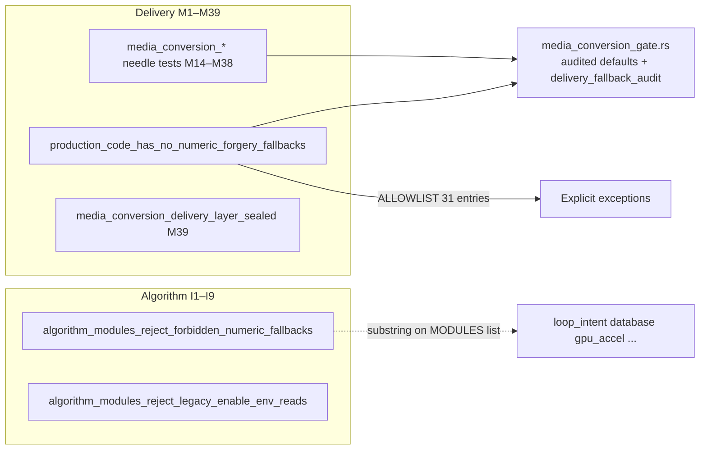

# SOURCE: MEDIA_CONVERSION_HARDENING_AUDIT.md

# Media conversion hardening — problem surface & structure

Deep audit snapshot (regenerate: `python3 crates/dev/scripts/media_conversion_delivery_heatmap.py --deep`).
Machine-readable: [`crates/dev/src/fixtures/media_conversion_deep_audit.json`](../crates/dev/src/fixtures/media_conversion_deep_audit.json).

## 1. Enforcement topology (three scanners, one gate)

| Scanner                 | What it catches                                              | What it misses                                                                     |
| ----------------------- | ------------------------------------------------------------ | ---------------------------------------------------------------------------------- |
| **M39 numeric**         | `unwrap_or(0)` / `map_or(0.0, …)` etc. in prod               | `map_or(100.0, …)`, `unwrap_or_default()`, string defaults, non-zero magic numbers |
| **M28–M38 needle**      | Per-file forbidden substrings + required gate symbols        | New files/patterns not added to test tables                                        |
| **Algorithm substring** | Fake probabilities, 0.5 priors, legacy `ENABLE_*` in MODULES | Generic `map_or(0, …)` unless literal appears in module source                     |
| **Gate file**           | Exempt from M39 numeric scan                                 | Must stay the only `log_anomaly!` emitter (baseline = 1)                           |

## 2. Problem classes (priority)

### P0 — Maintenance debt (not runtime risk)

| Item                        | Count               | Action                                                                     |
| --------------------------- | ------------------- | -------------------------------------------------------------------------- |
| **Stale ALLOWLIST** entries | **0** (M43 cleared) | Keep `ALLOWLIST` empty; route new defaults through `media_conversion_gate` |
| Stale examples (historical) | see phase A notes   | Code already hardened                                                      |

### P1 — Scanner blind spots (real gaps)

| Pattern                                             | Location                                                                      | Risk                                                                            |
| --------------------------------------------------- | ----------------------------------------------------------------------------- | ------------------------------------------------------------------------------- |
| `map_or(100.0, …)`                                  | `gpu_accel.rs:3749` (`best_size` missing → 100% improvement)                  | Explore/GPU UI metric; not in M39 pattern list                                  |
| `unwrap_or_default()`                               | Prod: essentially **gate only**                                               | Low if gate-only                                                                |
| `unwrap_or_else` estimate chain                     | `animated_image_quality_features.rs:177` compression_ratio                    | **Medium** — embeds heuristic when analysis missing; no `[delivery fallback:…]` |
| Needle tests **green while code uses other shapes** | e.g. M33 forbids `.unwrap_or(0.0)` in `video_quality_features` (already gone) | Tests pass; blind spot is **other** `unwrap_or_else` paths                      |

**Recommended scan extensions (next M40 prep):** `map_or(100`, `unwrap_or_default()` outside gate, `unwrap_or_else(|| estimate` in quality/embed modules.

### P2 — Live ALLOWLIST (0 entries) by domain

All historical allowlist exceptions (originally 18 entries) have been completely resolved and eliminated as of the **M43** milestone. Every production numeric-default fallback path has been routed through audited `media_conversion_gate` helpers, and the allowlist array in `test_real_silent_fallbacks.rs` is now completely empty (`const ALLOWLIST: &[(&str, &str)] = &[];`).

There are **0 live allows** in the codebase outside of the single gate file.

### P3 — High fallback density, weak test coverage

Files with many `unwrap_or` / `map_or` in prod but **not** named in `media_conversion_*` test tables (heuristic list):

| Fallback lines | Gate refs | File                                  | Layer                      |
| -------------- | --------- | ------------------------------------- | -------------------------- |
| 21             | 78        | `numeric_cast.rs`                     | Out of scope (strict cast) |
| 18             | 33        | `loop_intent.rs`                      | Algorithm overlap          |
| 17             | 15        | `gpu_accel.rs`                        | Algorithm + explore        |
| 15             | 62        | `video_explorer/gpu_coarse_search.rs` | Delivery explore           |
| 11             | 0         | `c_api.rs`                            | FFI (null ptr `map_or`)    |
| 9              | 20        | `batch.rs`                            | Orchestration              |
| 7              | 0         | `jxl_explorer.rs`                     | JXL explore (no gate)      |

**Structural gap:** M14–M38 cover ~60 paths; **~90+** other `.rs` files under `foundation/src` still contain Option defaults. Not all need gate helpers — but **jxl_explorer**, **quality_matcher** (partial), **image_metrics** are the next delivery-relevant clusters.

### P4 — Cross-layer overlap files

Same file audited by **delivery needles**, **numeric ALLOWLIST**, and **algorithm MODULES**:

`loop_intent.rs`, `database.rs`, `gpu_accel.rs`, `video_explorer.rs`, `quality_matcher.rs`, `animated_image_quality_features.rs`, `video_quality_features.rs`, `explore_strategy.rs`, `conversion.rs`

**Rule:** delivery changes must not break algorithm substring tests; algorithm scoring defaults must not masquerade as conversion success.

## 3. Suggested hardening phases

| Phase           | Scope                                    | Deliverable                                                                                                                                                                                                                 |
| --------------- | ---------------------------------------- | --------------------------------------------------------------------------------------------------------------------------------------------------------------------------------------------------------------------------- |
| **A**           | Hygiene                                  | ~~Drop 13 stale ALLOWLIST rows~~ **done** (31 → 16 live rows)                                                                                                                                                               |
| **B**           | Scan                                     | ~~Extend M39 `map_or(100.*)`~~ **done**                                                                                                                                                                                     |
| **C**           | Gate                                     | ~~M40 helpers~~ **done** (`probe_chroma_factor_or_default`, `explore_encode_size_improvement_pct`, `probe_compression_ratio_or_estimate`)                                                                                   |
| **D**           | Needle                                   | ~~M41 explore/JXL~~ **done** — next: `progress` mutex, `loop_intent` duration                                                                                                                                               |
| **E**           | Overlap                                  | ~~loop duration map_or~~ largely done in M42                                                                                                                                                                                |
| **F**           | Final allowlist                          | ~~M43 empty ALLOWLIST~~ **done**                                                                                                                                                                                            |
| **G**           | Extended blind spots                     | ~~M68 CPU/animation/env/icon/output-size~~ **done**                                                                                                                                                                         |
| **H**           | Substrate (FFI/JXL/loop/DB/JPEG)         | ~~M69~~ **done**                                                                                                                                                                                                            |
| **I (phase I)** | Audit policy                             | Gate helpers: audit only on true degradation under strict delivery; intentional baselines (JXL first probe, loop profile defaults, promote min-2 frames) stay silent; dev test `media_conversion_gate_audit_policy_phase_i` |
| **J**           | Precision parse sealing                  | ~~M70 VMAF/CAMBI/MS-SSIM parsers~~ **done**; ~~M71 MS-SSIM YUV bundle + vmaf_standalone~~ **done**; ~~M72 SSIM-All/PSNR/VMAF reject + calibration pix_fmt~~ **done**                                                        |
| **K**           | Central parsers + explore defaults       | ~~M73 unified `parse_explore_*` + GPU duration / adaptive floors / ffprobe duration text~~ **done**                                                                                                                         |
| **L**           | Parser residue sweep                     | ~~M74 `explore_strategy` / `video_explorer` PSNR + `gpu_coarse_search` quick SSIM~~ **done**                                                                                                                                |
| **M**           | Hardening anti-regression                | ~~M75 strict-gated parse reject audits; silent ffprobe duration parse; MS-SSIM composite float noise~~ **done**                                                                                                             |
| **N**           | GPU + stream-size audit policy           | ~~M77 GPU coarse fallback strict-gated; M78 stream-size probe failures strict-gated~~ **done**                                                                                                                              |
| **O**           | SSIM policy + contract closure           | ~~M79 CAMBI central parser + silent policy skips; M80 M1–M78 registry test~~ **done**                                                                                                                                       |
| **P**           | Calibration + progress mutex             | ~~M81 `dynamic_mapping` strict calibration audits; M82 progress ETA strict + mutex recover~~ **done**                                                                                                                       |
| **Q**           | GPU coarse explore audit policy          | ~~M83 explore diagnostics strict-gated; audio bitrate / CPU-only / x265 fallbacks via gate~~ **done**                                                                                                                       |
| **R**           | Precheck + stream_analysis audit policy  | ~~M84 duration ladder silent; nb_frames/integrity policy silent; degraded strict-only~~ **done**                                                                                                                            |
| **S**           | Quality + conversion + detection layout  | ~~M85–M88 quality/content_type, size-target reason, path layout, animated promote~~ **done**                                                                                                                                |
| **T**           | Explore display + boundary audit policy  | ~~M89 boundary CRF refine silent; progress SSIM silent; explore fail/MS-SSIM/ultimate summary strict-gated; `video_explorer` uses `explore_gpu_coarse_degraded_audit`~~ **done**                                            |
| **U**           | img/vid delivery API audit policy        | ~~M90 API/JXL encode recovery strict-gated; no direct `delivery_fallback_audit` in `conversion_api` / `lossless_converter` / `main`~~ **done**                                                                              |
| **V**           | Animated delivery path audits            | ~~M91 `animated_image` + `vid/conversion_api` path audits strict-gated~~ **done**                                                                                                                                           |
| **W**           | Gate path/label + JXL batch policy       | ~~M92 gate helpers strict/silent; JXL batch fallback wrapper~~ **done**                                                                                                                                                     |
| **X**           | Probe layer + substrate gate policy      | ~~M93 probe_layer strict; GIF FPS ladder / warm-start silent; substrate helpers strict~~ **done**                                                                                                                           |
| **Y**           | Pipeline / HDR / cleanup audits          | ~~M94 pipeline + HDR + cleanup strict-gated~~ **done**                                                                                                                                                                      |
| **Z**           | Delivery substrate wrapper strict policy | ~~M95 encode/gpu/io/runtime/checkpoint/metadata/intent strict; conversion/ffprobe routed~~ **done**                                                                                                                         |

## 4. Current metrics (audit JSON)

- ALLOWLIST: **0** total (M43 sealed)
- M39 numeric hits: **0 unallowlisted** (regenerate JSON after gate helper changes)
- Extended scan: `map_or(100.*)` routed via gate (`explore_encode_size_improvement_pct`, phase B)
- Forbidden M33 patterns in prod: **cleared** (`video_quality_features`, `scenario_quality_lookup`, etc.)
- M68 extended scan (2026-05-24): `map_or(4)` thread pools, `unwrap_or(2)` animation promote, `map_or(true)` training ingest progress, `progress_mode` `unwrap_or_default`, `vid` output metadata `map_or(estimate)` — routed through gate; M39 patterns include `unwrap_or(2)` / `map_or(4,`
- M69 substrate (2026-05-24): `c_api` probe `CString` null fallbacks, `jxl_explorer` previous size, `loop_intent` GIF `(0,0)` + filename density, `database` distribution `map_or(fallback)`, `image_jpeg_analysis` chroma `map_or` → `match`
- M70–M72 precision sealing (2026-05-24): explore metric parsers reject out-of-domain values (`seal_vmaf_y` / `seal_cambi` / `seal_ms_ssim` / `seal_ms_ssim_yuv_bundle` / `seal_ssim_yuv_all_bundle` / `seal_psnr`); no silent `clamp` on MS-SSIM YUV; `explore_calibration_pix_fmt_or_default`; dev tests `media_conversion_precision_metric_sealing_m70`–`m72` + `media_conversion_hardening_audit_snapshot`
- M73 central parsers (2026-05-24): `parse_explore_ssim_metric_token` / `parse_explore_psnr_metric_token` / `parse_explore_ms_ssim_score_token` replace scattered `is_valid_*` + silent `.parse().ok()` in `video_explorer`, `explore_strategy`, `gpu_accel`, `stream_size`; GPU coarse `explore_gpu_sample_duration_or_default` + adaptive floors in gate
- M74 parser residue (2026-05-24): `explore_strategy` + `video_explorer` PSNR + `gpu_coarse_search` quick SSIM use central parsers; no `f64::INFINITY` PSNR or manual `(0..=1).contains` on SSIM
- M79–M80 closure (2026-05-24): `parse_explore_cambi_metric_token`; `explore_ssim_metric_degraded_audit` (strict-only); policy MS-SSIM skips silent; `media_conversion_contract_m1_m78_design_complete` verifies all 78 contract rows + referenced dev tests
- M81–M82 (2026-05-24): `explore_calibration_degraded_audit` / duration / probe-size helpers; `dynamic_mapping` no always-on precheck audits; `delivery_progress_eta_unknown_audit` strict-gated; `active_progress_line` uses `mutex_guard_or_recover`
- M83 (2026-05-24): `explore_gpu_coarse_explore_audit` strict-only for phase-2/3 diagnostics; `explore_gpu_coarse_audio_bitrate_or_default`; policy skips (duration log, GPU SSIM baseline) silent in normal mode
- M84 (2026-05-24): `explore_precheck_degraded_audit` unifies precheck/stream/ssim operational audits; duration recovery ladder + SSIM method retry + CRF=0 soft-accept silent; `explore_precheck_nb_frames_or_zero`; explore outcomes strict-gated in `video_explorer`
- M85–M88 (2026-05-24): `quality_heuristic_fallback_audit`; `explore_size_target_failure_reason_or_default`; `delivery_path_layout_fallback_audit` + conversion path helpers; `probe_detection_recovery_audit` for animated promote
- M89 (2026-05-24): explore display helpers strict-gated (`explore_quality_fail_reason`, MS-SSIM, ultimate summary, quality gate/skip, CRF cache, SSIM measurement); `explore_boundary_crf_or_refined` + `explore_progress_ssim_token` silent; `explore_gpu_coarse_degraded_audit` for boundary size-cache miss in `video_explorer`
- M90 (2026-05-24): `delivery_api_path_fallback_audit` / `delivery_api_batch_fallback_audit` / `delivery_jxl_path_fallback_audit`; `img`/`vid` delivery APIs and JXL encode recovery no longer call `delivery_fallback_audit` directly in production
- M91 (2026-05-24): `animated_image` + remaining `vid/conversion_api` path audits via `delivery_api_path_fallback_audit`; `img/main` batch/path audits strict-gated
- M92 (2026-05-24): `delivery_jxl_batch_fallback_audit`; gate path/label helpers strict-only; `color_info_for_cjxl_prep` / `ffprobe_pix_fmt_or_empty` policy-silent; `jxl_explorer`/`jxl_utils` batch audits strict-gated
- M93 (2026-05-24): `probe_layer_audit` / `probe_layer_batch_audit` strict-only; GIF FPS recovery ladder + warm-start CRF + conversion SSIM token policy-silent; recovery/temp/AVIF/mutex substrate strict-gated
- M94 (2026-05-24): `delivery_pipeline_*`, HDR/Apple-compat, and `delivery_cleanup_audit` strict-gated for batch CLI orchestration
- M95 (2026-05-24): `delivery_substrate_*` strict wrappers for encode/gpu/io/runtime/checkpoint/metadata/intent; GPU concurrency/temp-ext policy-silent; `conversion`/`ffprobe`/`analysis_cache` use API/probe fallback audits
- M96 (2026-05-24): strict-audit single entry points `delivery_strict_path_audit`/`delivery_strict_batch_audit`; explore precheck/gpu coarse/pipeline wrappers delegate to SSOT helpers
- M97 (2026-05-24): JXL/layout/probe-recovery audits delegate to strict/probe SSOT; removed double strict wrappers on metric parse/calibration; gate inline `delivery_path_audit`/`delivery_batch_audit` in helpers routed through `delivery_strict_*` / `probe_layer_batch_audit`
- M98 (2026-05-24): gate `*_or_default` helpers consolidated to `delivery_strict_*` / probe strict delegates; `probe_layer_audit` no longer always-on; removed redundant `if strict { delivery_*_batch_audit }` on already-strict substrate wrappers
- M100 (2026-05-24): `delivery_path_audit`/`delivery_batch_audit` made `pub(crate)`; workspace production scan forbids direct emitter calls outside gate
- M101 (2026-05-24): contract registry `media_conversion_contract_m79_m100_design_complete`; `delivery_fallback_audit` `pub(crate)` completes emitter stack
- M102 (2026-05-24): unified `media_conversion_contract_m1_m103_design_complete` registry (103 milestones); `assert_media_conversion_contract_registry` helper
- M103 (2026-05-24): `batch.rs` path-tree cache roots use `canonicalize_for_tool_input` (5 sites); dev test `media_conversion_batch_path_tree_m103`
- M104 (2026-05-24): `quality_content_type_missing_audit` + `content_type_for_crf_analysis`; dev test `media_conversion_quality_content_type_m104`
- M105 (2026-05-24): `safety.rs` / `path_validator.rs` canonicalize via `canonicalize_for_tool_input`; dev test `media_conversion_path_canonicalize_m105`
- M106 (2026-05-24): production canonicalize seal + `common_utils` training map keys; dev test `media_conversion_canonicalize_ssot_m106`
- M107 (2026-05-24): `safety.rs` cwd for relative path normalization → `delivery_safety_relative_base_or_root` (preserves `/` when cwd unavailable; distinct from run-log `.`); dev test `media_conversion_safety_cwd_m107`
- M108 (2026-05-24): `gpu_accel.rs` quality score / ceiling CRF SSOT via `gpu_quality_compression_ratio_or_neutral` and `explore_gpu_quality_ceiling_crf_or_last_tested`; dev test `media_conversion_gpu_accel_numeric_ssot_m108`
- M109 (2026-05-24): `loop_intent.rs` bytes/frame, audible audio, fps kinetic weights → gate intent audits; dev test `media_conversion_loop_intent_numeric_ssot_m109`
- M110 (2026-05-24): `loop_intent.rs` threshold percentile fallback chains (`p25/p10`, `p50/p75`) route via `loop_duration_or_fallback`; dev test `media_conversion_loop_thresholds_ssot_m110`
- M111 (2026-05-24): `loop_intent.rs` inference defaults (p50 scale, pixels, duration-z, keywords, frame-count labels, parent depth) route via gate intent audits; dev test `media_conversion_loop_inference_ssot_m111`
- M112 (2026-05-24): `loop_intent.rs` diagnostic labels (probability, duration, neighbor suffix, layer tag) route via gate intent audits; dev test `media_conversion_loop_diagnostic_ssot_m112`
- M113 (2026-05-24): `progress.rs` explore iteration SSIM + `unified_error`/`app_error` FFmpeg exit-code suffixes → `ui_ssim_inline_or_empty` / `ui_exit_code_suffix_or_empty`; dev test `media_conversion_progress_ssim_exit_suffix_m113`
- M114 (2026-05-24): Animated image native timing SSOT: GIF/WebP fps from bitstream frame delays (not ffprobe guesses); coarse-iteration SSIM uses pending token when unmeasured; dev test `media_conversion_animated_timing_m114`
- M115 (2026-05-24): APNG native timing SSOT: fps/duration from `fcTL` delays + `acTL` frame count; `get_animation_duration` uses native PNG/WebP timing before ffprobe; dev test `media_conversion_apng_timing_m115`
- M116 (2026-05-24): FFprobe duration ladder SSOT: `resolve_probe_duration` uses native GIF/WebP/APNG timing then `nb_frames`/fps; GPU explore logs omit unmeasured SSIM (no `SSIM N/A` noise); dev test `media_conversion_probe_duration_ladder_m116`
- M117 (2026-05-24): Loop/telemetry audit policy: sparse inference JSON uses policy-silent optional helpers; loop duration fallbacks skip audit when profile percentiles absent; dev test `media_conversion_loop_inference_telemetry_m117`
- M118–M152 (2026-05-25): animated preflight/repair; analysis-cache full hit validation + six-helper I/O matrix + schema cutover audit; registry `media_conversion_contract_m1_m152_design_complete`
- M153–M159 (2026-05-25): Training corpus maturity and static ingest tier rules tightened; high and low static COMBINER uses ANY (one rule sufficient); balance caps and balance skew warnings; dev test `media_conversion_training_corpus_tier_m159`
- M160 (2026-05-25): Unified log layout SSOT: Python `mfb_log_paths` + Rust `LogConfig::unified_log_dir` using coerced log directories from environment overrides; dev test `media_conversion_unified_log_layout_m160`
- M161 (2026-05-25): Training audio / silent SSOT: loop training balance uses on-demand `detect_audio_silence` (ffmpeg `volumedetect`); dev test `media_conversion_training_audio_silence_ssot_m161`
- M162 (2026-05-25): Training loop lanes + media prefilter: four parallel training lanes (`static_high`, `static_low`, `loop_high`, `loop_low`); dev test `media_conversion_training_loop_lanes_m162`
- M163 (2026-05-25): Loop collect fail-closed: `animated_loop` local files must pass raster animation gate and loop intent probe; reject with `[LOOP-COLLECT] loop_probe_rejected`; dev test `media_conversion_training_loop_collect_static_raster_m163`
- M164 (2026-05-26): Tool path + FFI ingest path SSOT: external tools use `resolve_tool_path_or_audit` (no silent `PathBuf::from` fallback); C API batch ingest uses `ffi_ingest_path_list_or_delimited` JSON or pipe; dev test `media_conversion_tool_and_ffi_paths_m164`
- M165 (2026-05-26): Delivery batch + builder mutex SSOT: CLI batch errors and pause controller use `mutex_guard_or_recover` / `mutex_into_inner_or_recover`; tool-builder `RwLock` uses `rwlock_*_guard_or_recover`; dev test `media_conversion_delivery_batch_mutex_m165`
- M166 (2026-05-26): GPU + checkpoint mutex SSOT: progress lines, concurrency slots, and checkpoint maps use `mutex_guard_or_recover` (no raw `PoisonError::into_inner`); dev test `media_conversion_gpu_checkpoint_mutex_m166`
- M167 (2026-05-26): Discipline poison + logging/path cwd SSOT: production must not use raw `PoisonError::into_inner`; `delivery_cwd_or_audit` for cwd hints; `tracing_registry_env_filter_or_config` for `RUST_LOG` parse fallback; dev test `media_conversion_discipline_poison_logging_m167`
- M168 (2026-05-26): Conversion/img cwd SSOT: production must not call `std::env::current_dir()` outside gate; `delivery_join_relative_to_cwd_or_err` for output parent validation; dev test `media_conversion_conversion_cwd_m168`
- M169 (2026-05-26): Terminal lock / scratch temp / dir-lock registry SSOT: `delivery_terminal_lock_guard` for progress; gate-internal `delivery_system_temp_dir_ssot` for `std::env::temp_dir()`; `delivery_temp_dir_in_scratch_or_err` for vid scratch; dev test `media_conversion_terminal_temp_lock_m169`
- M170 (2026-05-26): Named temp file scratch SSOT: `delivery_named_tempfile_in_scratch_or_err` for production `NamedTempFile` / `.tempfile()` (excludes test modules from production scan); dev test `media_conversion_named_tempfile_scratch_m170`
- M171 (2026-05-26): Output-adjacent temp + MFB tmp discipline: `delivery_named_tempfile_in_parent_or_err` for HDR sidecar atomic persist; production must not call `.tempfile_in()` or `get_mfb_tmp_dir()` outside gate/`process_lock`; dev test `media_conversion_output_adjacent_temp_m171`
- M172 (2026-05-26): Parent directory contract: audited `path_parent_or_dot` / `path_relative_parent_or_self`; `delivery_create_dir_all_or_audit` / `delivery_ensure_output_parent_or_audit` (no silent `let _ = create_dir_all`); production must not use `parent().unwrap_or*` or `Path::new(".")` outside gate; dev test `media_conversion_path_parent_extreme_m172`
- M173 (2026-05-26): FS cleanup + path layout SSOT: `delivery_remove_file_or_audit` / `delivery_rename_or_audit`; `compute_relative_path` uses `strip_prefix_or_self`; production must not use silent `let _ = remove_file/rename/copy` outside gate; dev test `media_conversion_fs_strip_prefix_m173`
- M174 (2026-05-26): Path stem + audited remove SSOT: `path_robust_move_staging_path`; explore/IO/loop cleanup uses `delivery_remove_file_or_audit`; live photo uses `path_file_stem_or_empty` / `path_extension_lowercase_or_empty_unchecked`; dev test `media_conversion_path_stem_remove_m174`
- M175 (2026-05-26): Probe stem + inline remove SSOT: `path_file_stem_lossy_or_empty` for lightweight detection; delivery cleanup uses `delivery_remove_file_or_audit` (no `unwrap_or_else` on remove); dev test `media_conversion_remove_file_ssot_m175`
- M176 (2026-05-26): Extension label + stderr line SSOT: `path_extension_uppercase_or_unknown` for quality UI; production must not use `extension().map_or*` outside gate; stderr uses `encode_stderr_last_line_or_unknown` / `stderr_first_line_label`; dev test `media_conversion_extension_stderr_m176`
- M177 (2026-05-26): File name hot-path SSOT: `path_file_name_utf8_or_none` for IO filters; CLI progress uses `path_file_name_for_log`; dev test `media_conversion_file_name_hot_path_m177`
- M178 (2026-05-26): Strict delivery stem SSOT: OsStr-safe and UTF-8-safe stem helpers; production must not use `file_stem().ok_or*` outside gate; dev test `media_conversion_delivery_stem_strict_m178`
- M179 (2026-05-26): GPU/precheck numeric SSOT: `delivery_gpu_phase_best_size_or_zero`, `delivery_gpu_binary_search_crf_from_mid`, `explore_precheck_nb_frames_resolved`, `explore_quick_calibrate_mapper_or_default`; dev test `media_conversion_delivery_numeric_ssot_m179`
- M180 (2026-05-26): Probe decode + JPEG slice SSOT: `probe_image_decode_failure_or_unknown`, `probe_rational_from_f64_or_zero`, `probe_jpeg_buffer_slice`; dev test `media_conversion_probe_decode_jpeg_slice_m180`
- M181 (2026-05-26): Runtime/checkpoint field SSOT: `delivery_exiftool_field_or_empty` for date analysis; `delivery_checkpoint_lock_start_time_or_now` for checkpoint; dev test `media_conversion_runtime_checkpoint_fields_m181`
- M182 (2026-05-26): Quality/JPEG numeric SSOT: `quality_content_type_for_crf_or_unknown`; `delivery_jpeg_qt_cell_u16_or_one` for scale; dev test `media_conversion_quality_jpeg_numeric_m182`
- M183 (2026-05-26): Tool/training path + video CRF SSOT: `delivery_training_source_path_or_input`, `delivery_tool_path_or_bare_name`, `probe_video_crf_from_params_or_estimate`; dev test `media_conversion_tool_training_crf_m183`
- M184 (2026-05-26): Runtime infra SSOT: `delivery_path_env_or_empty`, `delivery_system_memory_mb_or_zero`, `delivery_rsync_executable_or_default`, `delivery_runtime_permille_u32_or_max`, `delivery_spinner_frame_index_or_zero`; dev test `media_conversion_runtime_infra_m184`
- M185 (2026-05-26): ffprobe stream sort SSOT: `probe_ffprobe_stream_nb_frames_sort_or_zero` (replaces inline `log_info` nb_frames miss); dev test `media_conversion_ffprobe_nb_frames_sort_m185`
- M186 (2026-05-26): Batch perceived-speed + analyzer probe closure: batch cache load uses explicit `match`; `image_analyzer` probe chains use audited gate helpers without inline `unwrap_or_else`; dev test `media_conversion_batch_analyzer_probe_m186`
- M187 (2026-05-26): DB percentile/metadata SSOT: `delivery_db_usize_or_zero` and `delivery_db_json_or_default` replace inline DB `unwrap_or_else` fallback/audit branches in percentile index + loop metadata parse; dev test `media_conversion_db_percentile_metadata_m187`
- M188 (2026-05-26): Runtime / UI / stream-size unwrap_or_else elimination: replace non-panic `unwrap_or_else` sites in `ctrlc_guard`, `modern_ui`, `quality_regression_model`, `lru_cache`, `stream_size`, `video_quality_detector` with explicit match/unwrap_or; dev test `media_conversion_runtime_ui_stream_m188`
- M189 (2026-05-26): Explore frame-count + JXL near-best margin SSOT: `explore_gif_frame_count_or_zero` / `explore_webp_frame_count_or_zero` and `delivery_jxl_margin_u64_or_one`; dev test `media_conversion_explore_jxl_margin_m189`
- M190 (2026-05-26): Image metrics + metadata-margin closure: remove non-panic `unwrap_or_else` in `image_metrics` and `video_explorer::calculate_metadata_margin` via explicit `match`/`unwrap_or`; dev test `media_conversion_metrics_metadata_margin_m190`
- M191 (2026-05-26): Runtime/explore critical-path closure: eliminate non-panic `unwrap_or_else` in scenario dispatch, cache prune counts, progress style fallback, lossless integrity checks, embedded classifier parse, JXL region bucket, video BPP/CRF conversion, checkpoint mtime epoch conversion, panic payload text, and duration diff rendering; dev test `media_conversion_runtime_explore_hardening_m191`
- M192 (2026-05-26): GPU/explore/pipeline `map_or` SSOT: gate helpers for animation-capable cache routing, GPU search summary, perceptual failure labels, calibration SSIM text, MS-SSIM duration skip, CLI extension/size reporting, and static AVIF quality args; dev test `media_conversion_gpu_explore_mapor_m192`
- M193 (2026-05-26): Probe/GPU-coarse `map_or` SSOT: gate helpers for path file-name logs, fusion SSIM floor, quality-check failure lines, explore SSIM ref labels, search-anchor CRF, classifier UNKNOWN, palette color diversity; dev test `media_conversion_probe_gpu_mapor_m193`
- M194 (2026-05-26): Batch/DB/conversion `map_or` SSOT: gate helpers for path mtime, batch depth, video frame-count estimate, sort-work overflow, BPP frame divisor, conversion size-diff tag, and conversion message bodies; dev test `media_conversion_batch_db_conversion_mapor_m194`
- M195 (2026-05-26): Analyzer/loop/HDR `map_or` SSOT: gate helpers for HEIC fallback canvas, HDR input label, HDR sidecar extension, and x265 params base; `image_analyzer` quality/JXL paths and `loop_intent` frame-delay extrema use gate/`match`/`reduce`; dev test `media_conversion_analyzer_loop_hdr_mapor_m195`
- M196 (2026-05-26): IO/GPU/vector/quality-db `map_or` SSOT: gate helpers `probe_io_fixed_slice_or_none` and `delivery_gpu_probe_failure_reason_or_default`; strict binary readers, GPU probe failure text, explore early-exit/progress render, KNN vector optional features, and quality-db JSON null fields use gate/`match`/`unwrap_or` instead of inline `map_or`/`map_or_else`; dev test `media_conversion_io_gpu_vector_db_mapor_m196`
- M197 (2026-05-26): Builders/progress/copier `map_or` SSOT: gate helper `delivery_imagemagick_cli_path_or_default`; ImageMagick builder, checkpoint hostname/path, CLI error category, UI search result, progress wrap/ETA, video color space, JPEG chroma/gainmap penalty, skip-copy paths, walkdir failure path, panic location, LRU cache load, video CRF estimate, and CJXL color prep use gate/`match` instead of inline `map_or`/`map_or_else`; dev test `media_conversion_builders_progress_copier_mapor_m197`
- M198 (2026-05-26): API/explore/FFI `map_or` closure: gate helper `probe_ffmpeg_stderr_tail_line_or_unknown`; img/vid output paths, GIF loop-meta, batch skip detection, x265 param keys, EXIF extension, inference timeout, XMP hint extension, log-prefix truncation, precheck bitrate, explore quality score text, C API ingest error pointer, and db diagnostics N/A cells use gate/`match` instead of inline `map_or`/`map_or_else`; dev test `media_conversion_api_explore_ffi_mapor_m198`
- M199 (2026-05-26): Runtime `unwrap_or` SSOT: gate helper `delivery_quality_model_python_command_or_default`; quality-model python command, inference timeout, panic payload text, duration-diff verify, and cache-invalidate audit strings use gate/`match` instead of silent `unwrap_or`/`unwrap_or_else`; M188 needle extended to block `unwrap_or("python3")` bypass; dev test `media_conversion_runtime_unwrap_or_m199`
- M200 (2026-05-26): Database/training `unwrap_or` closure: gate helpers for PG connstr default, subprocess log tails, path basename, argv0 basename, statvfs byte clamp, GIF frame `usize` overflow, and KNN duration baselines; dev test `media_conversion_database_training_unwrap_or_m200`
- M201 (2026-05-26): Database `or_else` + diagnostics cell SSOT: gate helpers `delivery_db_diag_cell_or_unknown`, `delivery_db_duration_p90_or_feature_stats`, `delivery_db_loop_aspect_ratio_or_derived`, `delivery_db_knn_neighbor_count_i32`; loop training row recovery via `loop_sample_row_or_reprobe_from_source`; dev test `media_conversion_database_or_else_m201`
- M202 (2026-05-26): Conversion/batch/CLI `or_else` SSOT: gate helpers `conversion_fallback_output_path_display`, `probe_identify_output_magick_then_system`, `delivery_cli_base_dir_or_input_when_output`, `delivery_pipeline_pixel_count_u64_or_none`; dev test `media_conversion_conversion_cli_or_else_m202`
- M203 (2026-05-26): ffprobe/loop `or_else` SSOT: gate helpers for stream bit-depth fields, fps avg/`r_frame_rate`, coded dimension fallback, zero-dimension recovery, encoder tag settings, HDR coord cast, loop p50/p75 duration, encoder software labels, inference probability/resolution-path fallbacks; `LoopMeta::tier` uses `loop_meta_duration_tier_or_from_secs`; dev test `media_conversion_ffprobe_loop_or_else_m203`
- M204 (2026-05-26): ffprobe HDR/JSON `or_else` closure: gate helpers for format loop-count tags, HDR luma raw cast, mastering-display chromaticity/luminance fields, CLL/MaxCLL pairs, and `ffprobe_json` bit-depth field chain; dev test `media_conversion_ffprobe_hdr_or_else_m204`
- M205 (2026-05-26): Animated/video quality timing `or_else` SSOT: gate helpers for frame-count/duration/fps/bitrate chains and PTS delay stats; dev test `media_conversion_quality_timing_or_else_m205`
- M206 (2026-05-26): Video detection `or_else` SSOT: gate helpers for PNG/APNG header bytes, WebP dimensions, bitstream/WebP recovery, derived bitrate; animated header preflight via `try_animated_header_preflight`; dev test `media_conversion_video_detection_or_else_m206`

## 3. Project-wide completion status (2026-05-26, M206)

Weighted view of **documented layer contracts** vs **runtime corpus proof**. “100%” on a row means **CI/registry covers that layer’s written invariants**, not bug-free on every file.

| Layer                           | Contract IDs                                 | Design / CI registry                                                                                                                             | Emitter / scan seal                                              | Runtime corpus (`/tmp` + your library)                           |
| ------------------------------- | -------------------------------------------- | ------------------------------------------------------------------------------------------------------------------------------------------------ | ---------------------------------------------------------------- | ---------------------------------------------------------------- |
| **Discipline (Rust+Py+sh)**     | **M39–M43, M68–M69, M158, M167**             | **100%** — `media_conversion_discipline_layer_closure_m158`                                                                                      | **100%** — numeric/M68/M69/temp/cwd scans green; ALLOWLIST empty | N/A                                                              |
| **Media conversion (delivery)** | **M1–M206** (206 rows)                       | **100%** — `media_conversion_contract_m1_m206_design_complete`                                                                                   | **100%** — M39 `media_conversion_delivery_layer_sealed`, heatmap | **~40–45%** — synthetic + spot repro; not full batch             |
| **Training ingest (Python)**    | **M153–M163**                                | **~100%** — maturity SSOT, static fill, balance caps, skew audit, low ANY, corpus tier, log layout, audio silence, loop lanes, and collect gates | N/A                                                              | **In progress** — static tier scan / ingest                      |
| **Algorithm (inference)**       | **I1–I10**                                   | **~95%** — doc + `algorithm_*` / forgery dev tests                                                                                               | Shared M39 numeric scan                                          | N/A (telemetry honesty, not transcode)                           |
| **Database (Postgres ingest)**  | **D1–D5**                                    | **~80%** — doc + `database_*` needle tests                                                                                                       | Via delivery gate audits (M21+)                                  | **~30%** — needs live DB refresh on corpus                       |
| **Terminal UI**                 | **U1–U15**                                   | **~85%** — doc + `ui_*` / icon stderr tests                                                                                                      | Plain/NO_COLOR paths tested                                      | Visual/manual                                                    |
| **Logging**                     | **L1–L13** (see `LOGGING_LAYER_CONTRACT.md`) | **~85%** — folded into M27/M44–M62/M160 + UI tests                                                                                               | Mutex/tracing gate (M44)                                         | Log file spot checks                                             |
| **Training tier**               | `training_tier_audit.rs`                     | Separate from delivery                                                                                                                           | N/A                                                              | Tier skew visible via M156 `[WARN] training_ingest_balance_skew` |

**Overall project (honest blend):**

| Slice                                                | Approx.                 | Notes                                                                                                |
| ---------------------------------------------------- | ----------------------- | ---------------------------------------------------------------------------------------------------- |
| Written delivery contracts + dev registry            | **100%** (M1–M206 rows) | Milestone table + referenced tests                                                                   |
| **Discipline layer (Rust+Py+sh)**                    | **100%** in CI          | `media_conversion_discipline_layer_closure_m158` / `media_conversion_discipline_poison_logging_m167` |
| Delivery substrate seal (M39, single `log_anomaly!`) | **100%** in CI          | Not “zero fallbacks on disk”                                                                         |
| Training pipeline contracts (M153–M163)              | **~100%** in CI         | Corpus fill is data, not contract %                                                                  |
| End-to-end “no surprises on your files”              | **~45–55%**             | Per-file `/tmp` validation                                                                           |
| “True 100%” (everything perfect on full library)     | **Not a target**        | Would need unbounded corpus QA + mature models                                                       |

**What “100%” already means today:** every **documented** delivery/training-ingest invariant in `MEDIA_CONVERSION_LAYER_CONTRACT.md` has a registry dev test. **What remains for “true 100%”:** (~50–55% gap) live corpus proof, balanced `image_quality_samples`, loop/video class if you enable KNN, and spot-fixing files that still emit `[delivery fallback:…]` for legitimate missing probes.

Latest milestones: **M118–M152** delivery/cache; **M153–M163** training/corpus + loop collect fail-closed; **M164–M206** FFI paths, mutexes, cwd normalizations, named tempfiles, path stem contracts, stderr label SSOTs, unwrap/map_or/or_else gate conversions.

See [`MEDIA_CONVERSION_DELIVERY_SEAL.md`](MEDIA_CONVERSION_DELIVERY_SEAL.md) “Completion note” for delivery-only scope boundaries.

## 4. Delivery slice detail (M206)

| Metric                                           | Approx.                                                                                        |
| ------------------------------------------------ | ---------------------------------------------------------------------------------------------- |
| Contract rows M1–M206                            | **100%** documented + registry-tested                                                          |
| Discipline closure M158/M167                     | **100%** — numeric + M68 + M69 + poison + cwd + temp scans empty in tests                      |
| Delivery emitter / numeric forgery seal (M39)    | **100%** in CI (`media_conversion_delivery_layer_sealed`)                                      |
| Real-world file success without any fallback log | **Not a goal** — legitimate missing data still emits `[delivery fallback:…]` under strict mode |
| End-user corpus validated in `/tmp`              | **Partial** — synthetic fixtures + selective repro; not full library sweep                     |
| Algorithm / training tier                        | **Out of scope** for M1–M156 delivery rows (separate I1–I10 contract)                          |

---

